# Argus Memory System — End-to-End Reference & Talk

> **Status:** Shipped in PR #66 (2026-04-18). Dual-read window active — legacy `{owner}--{repo}--{kind}` containers will be `BulkDelete`d per installation after operator verification of the migration backfill. Production hardening follow-up lives on branch `production-hardening` (retry/backoff, rate limit, tunable thresholds via org settings, nightly reconciler, `_shared` retirement policy).

## TL;DR

Argus stores structured review data in Postgres (source of truth) and mirrors it into Supermemory (semantic search layer) using **one container per repo** plus a single `_shared` container for cross-repo org rules. Every document carries typed metadata (`type=pattern|scenario|trace|feedback|synthesis|pr_summary|review|rule`) so retrieval filters by metadata instead of guessing the container kind. Writes are upserts via deterministic customIDs — nothing accumulates duplicates. Reads use hybrid semantic search with metadata filters, three parallel reads per file for specialists. BYOK: each GitHub installation has its own Supermemory key, so the key is the tenant boundary and no `owner` prefix is needed in container tags.

**Audience:** engineers owning or contributing to the pipeline, reviewers evaluating PR #66, anyone debugging a memory-related regression.
**Scope:** every read and write path between Argus and Supermemory, the state machines that govern them, failure modes, and the migration from the legacy shape.
**Source of truth:** `backend/internal/memory/{metadata.go, supermemory.go, indexer.go, registry.go}` + pipeline call-sites (`backend/internal/pipeline/*.go`).

---

## Part 1 — What memory is, and why we have it

### Two systems of record

Argus keeps two parallel stores:

| Store | Role | Access |
|---|---|---|
| **Postgres** | Source of truth for structured data: `patterns`, `scenarios`, `decision_traces`, `review_comments`, `simulation_results` | SQL, typed rows, strong consistency |
| **Supermemory** | RAG mirror for semantic retrieval during review | HTTP REST, hybrid search with rerank |

If Supermemory disappears tomorrow, no data is lost — every structured field lives in Postgres. Supermemory's role is purely to answer questions like *"have we seen a pattern like this before?"* fast and with semantic (not just lexical) matching.

### BYOK — the API key IS the tenant

Every GitHub installation configures its own Supermemory API key. The encrypted key lives in `installations.supermemory_key_enc` and is decrypted per-request in `backend/internal/memory/registry.go`. This means:

- No cross-installation contamination at the Supermemory level — each account holds only its own org's data.
- Container tags don't need `owner` prefixes — the key identifies the tenant.
- A revoked or rotated key takes effect on the next `InvalidateClient` call.

### Pipeline stages that touch memory

```
Triage → Review → Scoring → Pass2 → Synthesis → Post
                                                   ↓
                                     reactions / replies (webhooks)
```

- **Triage**: none
- **Review**: reads (specialist + review memory blocks per file)
- **Scoring**: writes (confirmed patterns at score ≥ 80/90)
- **Pass2**: writes (auto-learned patterns, conventions) and reads (scenario search on simulation failure, decision traces)
- **Synthesis**: writes (per-file synthesis prose, PR summary)
- **Post**: writes (batch review comments as `type=review`)
- **reactions**: writes (feedback signals — confirmed/dismissed)
- **replies**: writes (org-wide patterns from developer replies)

---

## Part 2 — Domain model

### Container topology

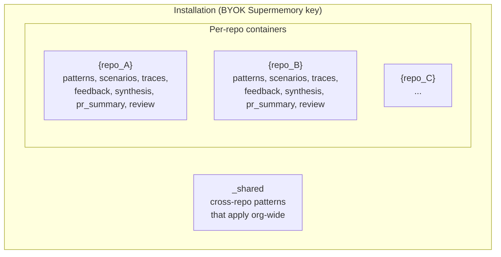

Design property: **container = identity**. Per Supermemory docs, the user-understanding graph is built on top of container tags. One container per repo gives us a coherent graph per repo (patterns connect to scenarios connect to feedback on the same file). `_shared` exists because some learned conventions apply across every repo in the org.

### Writes, by type and destination

Every write is an upsert via the listed customID. All paths use `v3/documents` — batch variants use `v3/documents/batch`. The legacy `v4/memories` endpoint (immediately searchable but no customID) was removed in Bundle 6 of the production-hardening pass; nothing in the pipeline requires immediate readback post-write.

| Write path | Container | metadata.type | metadata.subtype | API | Stable customID builder |
|---|---|---|---|---|---|
| Review comments (batch) | `{repo}` | `review` | — | v3 batch | `FindingFingerprint(repo,file,category,body)` |
| Confirmed pattern (score ≥ 80/90) | `{repo}` | `pattern` | `scoring_confirmed` | v3 | `PatternCustomID(_,repo,source,content)` |
| Auto-learned pattern | `{repo}` | `pattern` | `auto_learn` | v3 | same |
| Convention | `{repo}` | `pattern` | `convention_extraction` | v3 | same |
| File synthesis | `{repo}` | `synthesis` | — | v3 | `SynthesisCustomID(_,repo,file)` |
| PR summary | `{repo}` | `pr_summary` | — | v3 | `PRSummaryCustomID(_,repo,pr)` |
| Arch summary (choke points) | `{repo}` | `topology` | — | v3 | `arch-summary:{repo}` |
| Scenario | `{repo}` | `scenario` | — | v3 | `{repo}--scenario--{id}` |
| Decision trace | `{repo}` | `trace` | `review_finding` etc. | v3 | `TraceCustomID(repo,file,type,content)` |
| Simulation result | `{repo}` | `trace` | `simulation_result` | v3 | `SimulationCustomID(repo,pr,scenario)` |
| Feedback signal | `{repo}` | `feedback` | — | v3 | `FeedbackCustomID(_,repo,file,category,body,action)` |
| Org-wide pattern | `_shared` | `pattern` | `auto_learn` / `reply_feedback` | v3 | `SharedPatternCustomID(source,content)` |
| Rule | `_shared` | `rule` | — | v3 | `rule--{rule_id}` |

### Example document (what actually lands in Supermemory)

```json
{
  "content": "Avoid string interpolation in SQL queries — use parameterized placeholders ($1, $2) so user-controlled values never become executable SQL. Observed 3x in review as a 'critical' finding over the last quarter; consistently dismissed as 'low risk because internal API' but one regression reached production in Q2.",
  "customId": "web--scoring-confirmed--a7f3c2d9b81e",
  "containerTags": ["web"],
  "metadata": {
    "schema_version": "1",
    "type": "pattern",
    "subtype": "scoring_confirmed",
    "file_path": "src/db/query.ts",
    "category": "security",
    "severity": "high",
    "score": "92",
    "source": "argus:confirmed",
    "pr_number": "331",
    "pr_author": "alice",
    "created_at": "2026-04-18T14:22:09Z"
  }
}
```

Notes for readers: content is pure prose (no `[category]` or `File:/Severity:` prefixes — those are metadata), `schema_version` is always emitted so future migrations can distinguish document versions, and the customID deterministically hashes `(source, normalized_content)` so re-learning the same pattern upserts instead of creating a duplicate.

### Reads, by call site and query shape

| Caller | Container(s) | Filter (metadata) | Limit | Threshold |
|---|---|---|---|---|
| Finding enrichment (`orchestrator.go:970`) | `{repo}` + `_shared` + legacy dual-read | `type=pattern` | 1 each, 4 parallel | 0.5 |
| Specialist block — synthesis (per file) | `{repo}` | `AND(type=synthesis, file_path=X)` | 1 | 0 (filter-pinned) |
| Specialist block — repo signal | `{repo}` | `OR(type=pattern, type=scenario, type=feedback)` | 5 | 0.6 |
| Specialist block — shared | `_shared` | `AND(type=pattern)` | 3 | 0.6 |
| Scenario search (simulation failure) | `{repo}` + legacy | `AND(type=scenario[, severity=X])` | configurable | — |
| Trace search (currently unused in pipeline) | `{repo}` + legacy | `AND(type=trace[, subtype=X])` | configurable | — |
| Pattern-filtered search | `{repo}` + legacy | `AND(type=pattern[, category=X])` | configurable | — |

---

## Part 3 — Metadata schema (typed, not stringly-typed)

The central invariant: **structured data lives in metadata, content is pure prose**. The vehicle is the `Metadata` struct in `backend/internal/memory/metadata.go`:

```go
type Metadata struct {
    Type       MemoryType   // required; one of TypePattern/TypeScenario/...
    Subtype    string       // free-form
    FilePath   string
    Category   string
    Severity   string
    Polarity   Polarity     // required iff Type == TypeFeedback
    Action     string       // required iff Type == TypeFeedback
    PRNumber   int          // 0 means absent
    PRAuthor   string
    ScenarioID int64        // 0 means absent
    Score      int          // 0 means absent
    Source     string
    CreatedAt  time.Time
    Extra      map[string]string // escape hatch
}
```

`ToMap()` validates the per-type invariants and flattens to `map[string]string` before the API call:

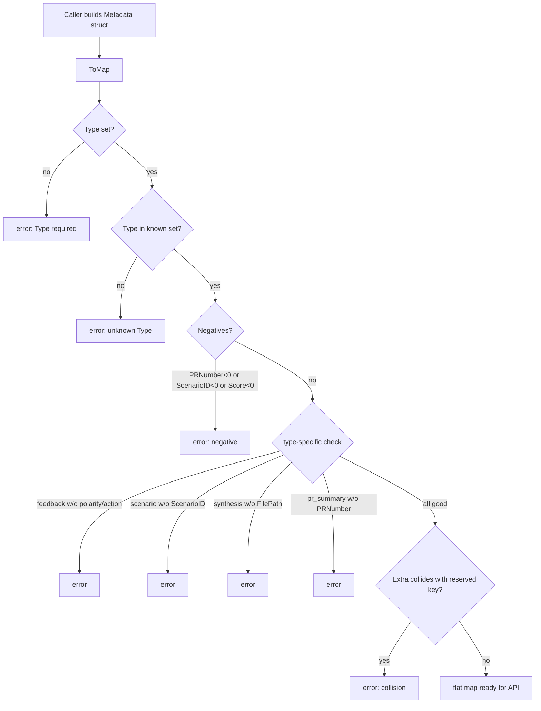

**Why this matters:** illegal states (a feedback doc with no polarity, a scenario doc with no `scenario_id`) are unrepresentable at write time. Without this validator, the misshapen doc would index silently and only surface as wrong results at query time — miles away from the bug.

---

## Part 4 — CustomID discipline

Every write gets a deterministic, hash-stable `customId`. Re-indexing the same logical entity upserts instead of accumulating duplicates. The builders live in `indexer.go` and share a pattern: `{sanitized_repo}--{source}--{hash12}` capped at Supermemory's 100-char limit.

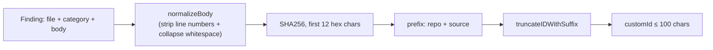

**Why normalize the body first?** So a reviewer repeating the same finding with a different line number doesn't produce a new doc. The hash input is the *semantic* fingerprint, not the textual one.

**Special case: `FeedbackCustomID` includes `action`.** Same finding dismissed in PR #100 then confirmed in PR #150 produces two distinct docs (different customIDs) that coexist. Without `action` in the hash, the second write silently overwrote the first with the opposite signal.

**Length invariant.** Supermemory rejects customIDs longer than 100 chars with a 400. Every builder routes through `truncateIDWithSuffix`, which preserves the final 12-char hash (the disambiguator) and truncates the prefix if needed — so long file paths don't cause collisions via suffix-cropping. The hash remains intact for debuggability: log the customID, reproduce it locally by running the same builder with the same inputs.

---

## Part 5 — State machines

### 5.1 Registry / client lifecycle

Per-installation caching with lazy initialization and retry-safe filter disablement.

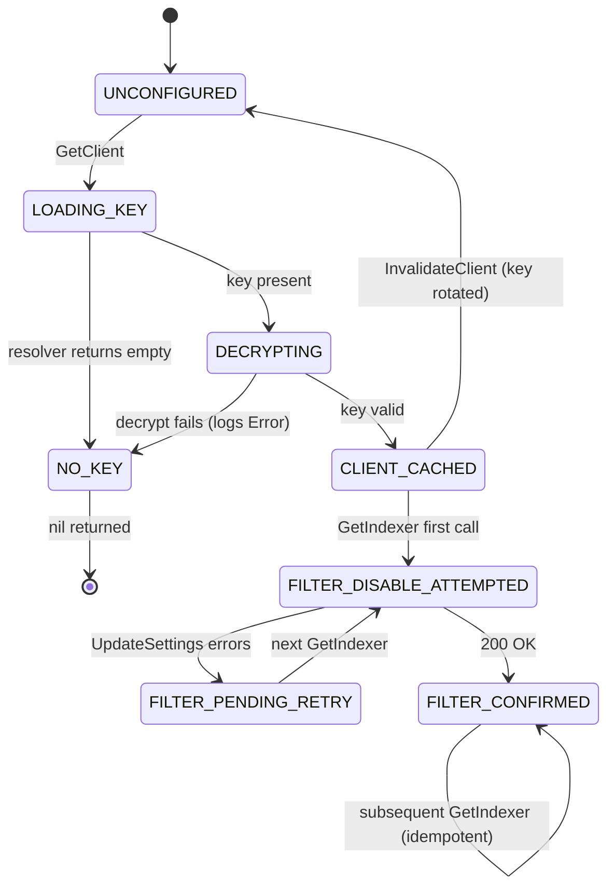

**Key property fixed in PR review round:** `filterDisabled[id]=true` now only flips on a successful `DisableLLMFilter`. Pre-fix, a transient 5xx would leave the LLM filter enabled forever for that process.

### 5.2 Document write path

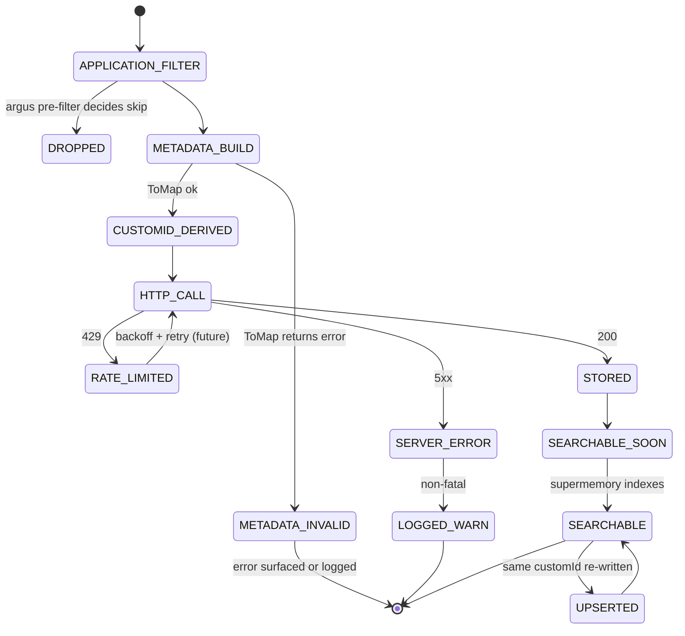

**Single write path post-hardening:** `v3/documents` — queued processing, upsert on customID collision. Used for every write. The `v4/memories` path (immediately searchable but no customID → duplicates accumulate) was removed in Bundle 6 of the production-hardening pass; nothing in the pipeline needs same-run readback, and keeping both endpoints risked reintroducing the duplicate-accumulation bug. `STORED → SEARCHABLE_SOON → SEARCHABLE` transitions take seconds to minutes per Supermemory's own documentation.

### 5.3 Feedback signal state machine

A review comment travels through the pipeline, gets posted to GitHub, and then a human reacts or replies. The memory system reflects that feedback:

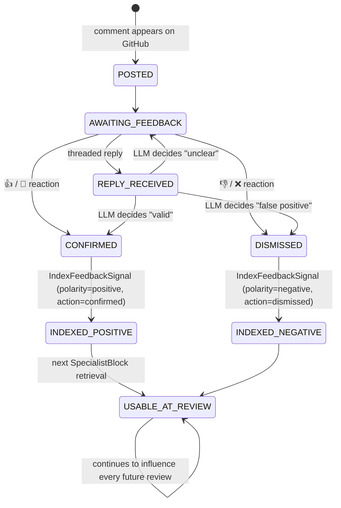

**CustomID includes `action`.** Same finding dismissed-then-confirmed produces two coexisting docs. Specialists see both: "developer dismissed this last month but confirmed a variant this week." Rich signal, no silent overwrites.

### 5.4 Scenario lifecycle

Scenarios are the richest state machine — they live in both Postgres and Supermemory and accumulate trigger counts.

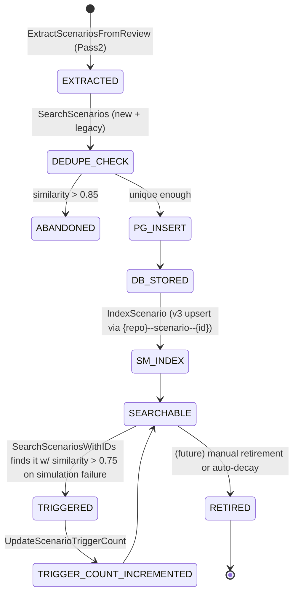

**Why dual-store?** Postgres gives structured queries like *"show me all critical scenarios for this repo last month"*. Supermemory gives semantic matching: *"does this new failure match any known scenario?"* — neither store alone answers both classes of question.

### 5.5 Migration state machine (operational only)

During the transition from the legacy 7-container shape to the unified `{repo}` / `_shared` shape, the system dual-reads to avoid data loss:

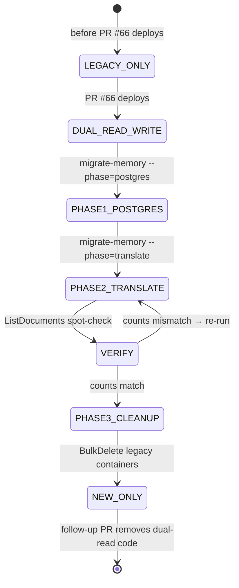

**Rollback safety:** at every step until PHASE3_CLEANUP, the legacy containers still exist. Reverting the app code continues reading them.

**Hard exit condition for dual-read code.** The per-installation transition should not span more than one release cycle. **Dual-read branches in `SearchPatternMatch`, `SearchScenariosWithIDs`, `SearchTraces`, `SearchPatternsFiltered`, and `topMatchExcludingSources` MUST be removed within one release of PHASE3_CLEANUP for the last installation.** Long-lived dual-read doubles search cost, pollutes log volume, and hides bugs in the new container by silently falling back to legacy. Track the removal PR as blocking on "all installations confirmed at PHASE3_CLEANUP" and enforce via a scheduled task, not a good intention.

---

## Part 6 — Sequence diagrams

### 6.1 Pipeline end-to-end (one PR review)

```mermaid
sequenceDiagram
    autonumber
    actor GH as GitHub webhook
    participant Orc as Orchestrator
    participant RS as ReviewStage
    participant Idx as Indexer
    participant SM as Supermemory
    participant PG as Postgres
    GH->>Orc: pull_request.opened
    Orc->>PG: create review row
    Orc->>Idx: Registry.GetIndexer(installation)
    Idx->>SM: PATCH /v3/settings shouldLLMFilter=false
    Note over Idx: first call only. marks filterDisabled on 200
    Orc->>Orc: Triage stage (no memory ops)
    Orc->>RS: Review stage per file
    loop per file
        RS->>Idx: SpecialistBlock(owner, repo, file, query)
        par 3 parallel reads
            Idx->>SM: Search repo container filter synthesis and file
        and
            Idx->>SM: Search repo container filter OR pattern scenario feedback
        and
            Idx->>SM: Search _shared container filter pattern
        end
        Idx-->>RS: MemoryBlock with synthesis repo and shared
        RS->>RS: format into specialist system prompt
        RS->>RS: call LLM for findings
    end
    Orc->>Orc: Scoring stage
    loop per confirmed finding score ge 80
        Orc->>Idx: IndexRepoPattern(repo, content, customID, meta)
        Idx->>SM: POST /v3/documents upsert
        Orc->>PG: CreatePattern mirrors SM id
    end
    Orc->>Orc: Pass2 stage
    Orc->>Idx: IndexDecisionTrace per finding
    loop if simulation enabled and failed
        Orc->>Idx: SearchScenariosWithIDs(repo, scenario, severity, 1)
        Idx->>SM: Search repo container filter type scenario
        Idx->>SM: Search legacy scenarios container dual read
        Idx-->>Orc: ScenarioSearchResult list
        alt similarity above 0.75
            Orc->>PG: UpdateScenarioTriggerCount
        end
        Orc->>Idx: IndexSimulationResult
    end
    Orc->>Orc: Synthesis stage
    loop per file up to 10
        Orc->>Idx: IndexRepoPattern source synthesis routes to type synthesis
    end
    Orc->>Idx: IndexRepoPattern source pr_summary routes to type pr_summary
    Orc->>Orc: Post stage
    Orc->>Idx: IndexReviewCommentsBatch
    Idx->>SM: POST /v3/documents/batch
```

### 6.2 Specialist retrieval (deep dive)

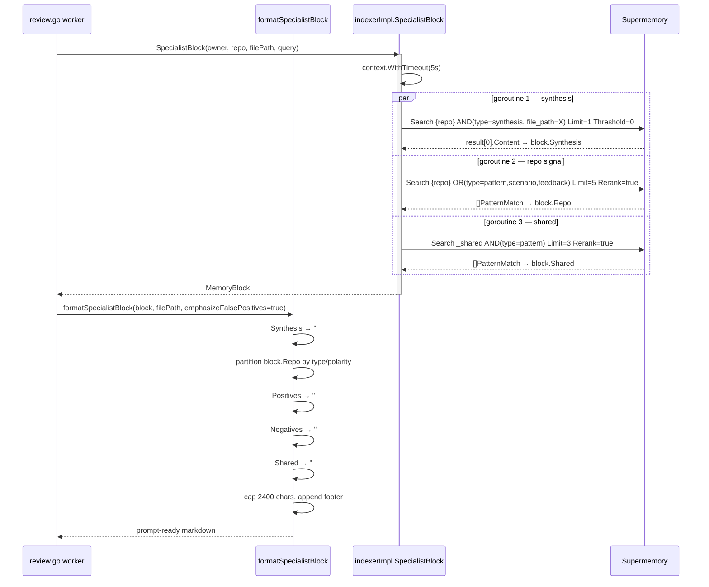

**Critical property:** goroutines write to *distinct fields* of `MemoryBlock`. No shared mutable state, no mutex. `wg.Wait()` is the happens-before edge.

### 6.3 Feedback reaction flow

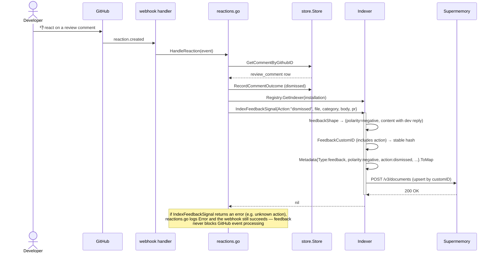

### 6.4 Migration (post-merge, manual)

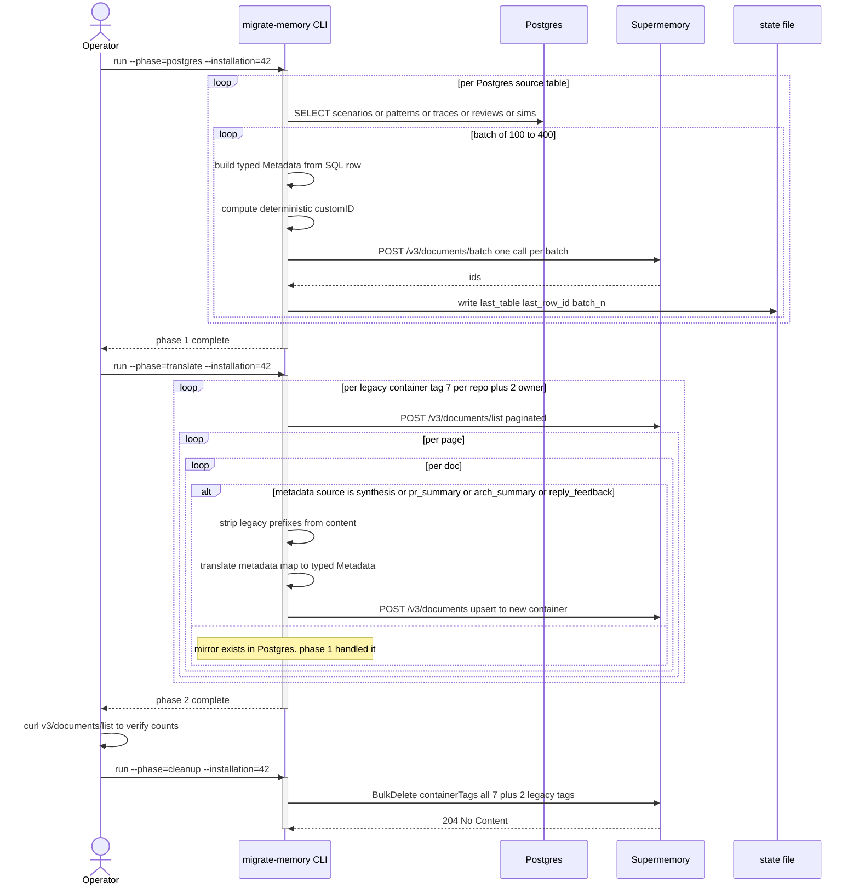

---

## Part 7 — Read-path edge cases

### 7.1 Dual-read merge logic

During the transition, search methods union results from the new container (typed metadata) and the legacy container (kind-suffixed). Three distinct dedup strategies are in play:

| Method | Dedup key | Why |
|---|---|---|
| `SearchPatternMatch` | best-scoring across all 4 goroutines (via `bestMatch`) | Only 1 result returned; no overlap issue |
| `SearchScenariosWithIDs` | **scenario_id** (not doc_id) | Same scenario in both containers has different doc IDs |
| `SearchTraces` / `SearchPatternsFiltered` | Supermemory doc_id | Traces and filtered patterns return raw content; doc uniqueness suffices |

**Why not use doc_id for scenarios?** Because during dual-read, the same logical scenario exists as two supermemory documents (one per container). Dedup by doc_id would return the same scenario twice, consuming two slots in the caller's `limit` budget.

### 7.2 Legacy container source-filtering

Legacy `{owner}--{repo}--patterns` held mixed writes: patterns, syntheses, PR summaries, arch summaries, feedback. A `nil` filter on legacy reads would let a stray synthesis outrank a real pattern in `SearchPatternMatch`. Fix: `topMatchExcludingSources` takes top-3 from legacy and drops any whose `metadata.source` is in a blocklist.

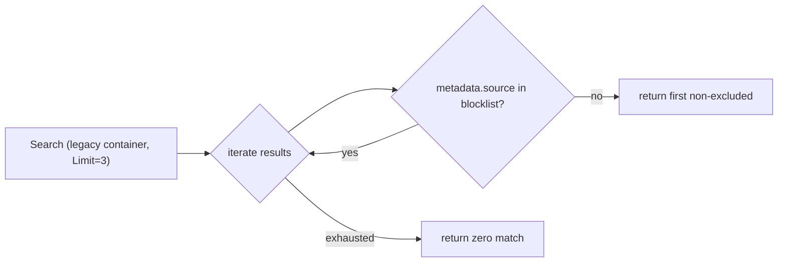

Blocklist: `synthesis`, `pr_summary`, `arch_summary`, `feedback_confirmed`, `feedback_dismissed`.

**Transitional only.** The blocklist exists to protect against mixed legacy containers during the dual-read window. Once PHASE3_CLEANUP finishes and the old containers are gone, `topMatchExcludingSources` and its blocklist come out too — new-shape reads explicitly pin `metadata.type` at search time (e.g. `type=pattern` on `{repo}`, `type=rule` on `_shared`), so there's nothing left to post-filter out client-side. Remove in the same follow-up PR that drops dual-read.

### 7.3 Synthesis retrieval — Search, not List+Get

Earlier design used `ListDocuments` (metadata-filtered) then `GetDocument` by ID to fetch the body. That path was broken: `Document` struct decodes only `{ID, Title, Status}` — no body fields. The content silently came back as `doc.Title` (often the first line or the sanitized customID). Every specialist briefing lost its file history.

Current design uses `Search` with the metadata AND filter, which returns `r.Memory` / `r.Chunk` in the result. One API call, real body.

---

## Part 8 — Failure modes and observability

### 8.0 Consistency model — there is no read-after-write guarantee

Supermemory documents transition through three states on a write: **STORED** (accepted by the API), **SEARCHABLE_SOON** (indexing in progress), **SEARCHABLE** (visible to queries). Official docs quote "seconds to minutes depending on content size." This means:

- **No pipeline stage assumes it can search a doc it just wrote.** If a later stage needs the data in the same run, it must carry it in-memory, not re-query Supermemory for it.
- **Re-reads after a failed write are not safe retries.** Postgres is the source of truth — confirm writes there first, use the reconciler to resync Supermemory lazily.
- **Specialists never race their own writes.** The specialist block reads memories indexed in PRIOR reviews, never in the same pipeline run.

If a future feature needs immediate readback (same-run), it must either track data in-memory or wait on an explicit indexing receipt (which Supermemory does not currently provide). Do not design against eventual consistency.

### 8.1 Classification of failure handling

| Failure | Handler | Rationale |
|---|---|---|
| Supermemory 5xx on write | log `Warn` or return err up | Non-fatal: Postgres is source of truth; retry on next PR |
| Supermemory 5xx on search | log `Debug` (legacy) / `Warn` (new) | Partial-result answers beat no answer; caller falls back to empty list |
| Context cancelled mid-search | bubble up | Normal on pipeline timeout |
| Context cancelled mid-write | bubble up + log | Writes may be retried by next pipeline run |
| `Metadata.ToMap` validation error | return err to caller | Indicates a caller bug, not a runtime condition |
| Unknown feedback action | return err (post-fix) | Previously silent drop; now caller sees it |
| Partial batch drop (`IndexReviewCommentsBatch`) | log `Error` with counts; return err if 100% | Reconcile jobs need visibility |
| Scenario with no `scenario_id` | log `Warn` | Migration bug visibility |
| `DisableLLMFilter` transient error | retry on next `GetIndexer` | Prevents silent "filter enabled forever" |

### 8.2 Key log lines

```
INFO  indexed repo pattern repo=acme-web source=synthesis
INFO  indexed feedback signal action=dismissed repo=acme-web file=src/auth.ts
INFO  batch indexed review comments repo=acme-web count=42
ERROR batch indexed review comments with drops repo=acme-web indexed=38 skipped=4
WARN  scenario missing id doc_id=mem_abc123 content_head="Payment webhook race..."
DEBUG legacy scenarios search failed error="..." tag=acme--acme-web--scenarios
WARN  disabling supermemory LLM filter (will retry) error="..." installation_id=42
```

### 8.3 Metrics to add (follow-up)

- `memory_write_total{type, status}` — counter
- `memory_search_latency_ms{container, rerank}` — histogram
- `memory_search_errors_total{method, stage}` — counter
- `memory_batch_partial_drops_total{container}` — counter

---

## Part 9 — Talk script

**Speaker notes, 15 minutes, 4 acts.**

### Act 1 — The problem (3 min)

> "Argus uses Supermemory as a RAG store. Pre-refactor we split every repo's data into seven containers: `{owner}--{repo}--reviews`, `--patterns`, `--positive_patterns`, `--negative_patterns`, `--scenarios`, `--traces`, plus one `{owner}--rules` and `{owner}--patterns` at the org level. Each container had its own write path, its own read path, and its own metadata shape.
>
> Supermemory's docs say — and I'm quoting directly — *'the user understanding graph is built on top of container tags.'* We were fragmenting that graph seven ways per repo. Scenarios couldn't link to patterns. Patterns couldn't link to feedback. Every read had to know the container kind upfront, and every write had to pick one.
>
> Worse, content was polluted with structural prefixes. Scenario docs started with `[scenario_id:42]`. Feedback docs started with `POSITIVE_PATTERN: [security]`. Review docs started with `File: X\nSeverity: Y\nCategory: Z`. We were vectorizing the same prefixes across hundreds of docs, collapsing the semantic space that embeddings depend on. And one read path — `SearchScenariosWithIDs` — parsed the `scenario_id` back out of the content with a regex. That was the clearest signal something was wrong."

### Act 2 — The model (5 min)

> "The refactor makes three changes.
>
> **One: one container per repo.** Everything for a repo lives in `{repo}`. Cross-repo patterns go to `_shared`. We drop the owner prefix entirely because Supermemory is BYOK — each installation has its own API key, and the key IS the tenant. The graph re-coheres at the repo level. Every memory about a repo can now connect to every other memory about that repo.
>
> **Two: typed metadata, not stringly-typed.** We introduce a `Metadata` struct with a `ToMap()` validator. A feedback doc without polarity won't index. A scenario doc without a scenario_id won't index. Illegal states are unrepresentable at write time instead of silently returning wrong results at query time. This is the 'parse, don't validate' pattern — if your data gets past the type system, you can trust it.
>
> **Three: stable customIDs everywhere.** The old code had five write paths that accumulated duplicates forever — traces, simulation results, topology, rules, and the v4-fallback pattern path. Every one now has a deterministic hash-based customID, and re-indexing upserts. One subtle fix: `FeedbackCustomID` now includes the `action`. Before, dismissing a finding then later confirming a variant silently overwrote the first signal. Now both coexist, and specialists see the full history.
>
> Content follows: pure prose. No prefixes, no headers. Structure lives in metadata."

### Act 3 — The retrieval win (4 min)

> "Pre-refactor, specialist briefings did five parallel semantic searches per file: file synthesis, repo patterns, org patterns, negative patterns, positive patterns. Fifty searches per PR on a ten-file review. Every one of those searches blended different container shapes and fought the rerank model for signal.
>
> Post-refactor, `SpecialistBlock` does three reads per file: one metadata-pinned search for the file's synthesis (exact file_path match — no fuzzy), one semantic search over the repo container filtered to `type IN {pattern, scenario, feedback}`, and one semantic search over `_shared` for org patterns. Twenty reads per PR instead of fifty. Cheaper, faster, and rerank has a clean candidate pool.
>
> The code moved too: the retrieval logic used to live in `specialists.go` as a 70-line goroutine fan-out with manual tag plumbing. Now it's 30 lines in `indexer.go` returning a `MemoryBlock` value, and `specialists.go` just formats it. Retrieval is the memory package's responsibility; the pipeline just consumes."

### Act 4 — Migration and safety (3 min)

> "We can't flag-day this. There's live data in the old containers across every installation. So the refactor is paired with a migration command that runs post-merge, in three phases.
>
> Phase one rebuilds structured memories from Postgres. Patterns, scenarios, traces, feedback, review comments — every one of those has a typed SQL row that already holds what we need. Build a typed `Metadata`, emit the new document, upsert.
>
> Phase two handles unmirrored docs. Syntheses, PR summaries, arch summaries, reply-feedback learnings — these were Supermemory-only pre-refactor. No Postgres mirror. For these, we ListDocuments on the legacy container, strip the content prefix, translate the metadata map, write to the new container.
>
> Phase three bulk-deletes the legacy containers.
>
> Critically: between phases one and three, the app dual-reads. Live reviews see both shapes. If phase one fails mid-run, phase two fails, or operator catches anything wrong during verification — roll back the deploy and the legacy data is still there. The only destructive step is the final BulkDelete, and that only runs after explicit operator verification.
>
> Zero schema change in Postgres. Zero downtime. Every user-facing feature preserved."

**Closing:** hand over to Q&A with the sequence diagram from Part 6.1 on screen.

---

## Part 10 — Production hardening (branch `production-hardening`)

PR #66 delivered the architectural core. The `production-hardening` branch — stacked on top, not yet merged — rolls in six bundles that make the system safe to run unattended in production.

### 10.1 Retry, backoff, and rate limiting

**Backoff** (`backend/internal/memory/backoff.go`). Every HTTP call through `Client.doRequest` is wrapped in an exponential-backoff retry. Three attempts max, delays 250ms → 500ms → 1s with ±50ms jitter. Total worst-case retry time is ~1.75s, which fits cleanly inside the 5-second search context budget. Retryable: HTTP 429, 502, 503, 504. Short-circuit: any 4xx (caller error), 500 (application error; retry just wastes quota). Respects `Retry-After` headers — up to a 30-second cap so a misconfigured server can't stall a pipeline goroutine for an hour.

**Rate limiting** (`backend/internal/memory/ratelimit.go`). Per-installation token bucket via `golang.org/x/time/rate`. Default: 50 QPS sustained, 100 burst. `waitForToken` caps the block at 5 seconds — a saturated bucket surfaces as an error quickly rather than starving pipeline goroutines.

**Why these numbers.** A 40-file deep review does 3 reads per file × 4 specialists = 480 searches. At 50 QPS sustained, that's ~10 seconds of pure memory work — slow enough to absorb into a 2-minute pipeline, fast enough that concurrent PRs don't starve each other.

### 10.2 Webhook idempotency

GitHub retries webhooks aggressively. The same `reaction.created` event can fire 2–3 times. The `comment_outcomes` table had no uniqueness constraint, so duplicates accumulated and skewed analytics.

Migration 037 adds `UNIQUE (review_comment_id, outcome)`. The query uses `ON CONFLICT DO NOTHING`. Retried webhooks are silently deduplicated at the storage layer. No caller-side changes.

### 10.3 Thresholds configurable via org settings

The four magic numbers (0.5 enrichment, 0.6 specialist, 0.75 scenario trigger, 0.85 scenario dedup) are now exposed in `repoSettings` as nullable fields. `parseThresholds` resolves them with defaults, logs warnings on out-of-range values, and plumbs the resolved `memory.Thresholds` struct through `PipelineRun` to every call-site that needs them. Every threshold check emits a structured log line:

```
INFO threshold_check name=scenario_trigger value=0.81 threshold=0.75 passed=true
```

So you can answer "what % of candidates pass each threshold?" in prod without deploying a metrics library.

### 10.4 Reconciler

**Purpose.** Postgres is the source of truth. When a Supermemory write fails, we log and continue — the PG row gets created without a `supermemory_id`. Over time, PG drifts ahead of Supermemory. The reconciler (`cmd/reconcile-memory/main.go`) is a daily batch job that finds `supermemory_id IS NULL` rows and retries the index call.

**Deployment.** Dedicated Fly scheduled machine, `3am UTC` daily. Isolated from the main app so a reconciler bug can't stall live reviews.

**Safeguards.**
- Circuit breaker: aborts a phase after 5 consecutive per-row failures (was an infinite-loop hazard before review round).
- Paginated, resumable: SIGTERM during a batch commits the current page and exits cleanly.
- `--plan` dry-run flag to preview writes without hitting the API.
- `--max-rows` safety cap per phase per installation.

**Three phases.** `reconcilePatterns`, `reconcileScenarios`, `reconcileTraces` — mirror of the `patterns / scenarios / decision_traces` tables. Org-wide patterns (NULL `repo_id`) route through `IndexOwnerPattern` into `_shared`, repo patterns through `IndexRepoPattern`.

### 10.5 `_shared` container retirement

**Problem.** Pre-hardening, `_shared` grew monotonically. A bad pattern learned from a single developer reply would silently influence every review across every repo — forever.

**Policy (retire-only variant).**
- Every `_shared` write stamps `metadata.confidence = 1.0` plus origin metadata (`origin_pr`, `origin_author`) for auditability.
- The reconciler's second phase (`decayShared`) walks the `_shared` container, reads `metadata.updated_at`, computes how far past the 30-day grace window each doc is, and derives a projected confidence via `conf - (weeksPastGrace × 0.05)`. Docs whose projected confidence drops below 0.2 get `DeleteMemory`'d. Re-upserting (via the customID) resets the clock.
- Legacy `_shared` docs missing the `confidence` field are treated as `confidence=1.0` — they age normally rather than living forever.

**Why retire-only, no gradual confidence updates.** Supermemory doesn't expose a metadata-patch API. Updating confidence in-place would require re-fetching full content + re-`AddMemory`ing, doubling API quota cost per decay step. The retire-only variant gets the hygiene win — stale `_shared` docs stop influencing reviews — without the write amplification. Gradual confidence lands if/when Supermemory ships PATCH.

**Opt-out.** `repoSettings.disable_shared_decay` — admins who want belt-and-suspenders keep-everything-forever behavior set this true, and the reconciler's decay phase short-circuits. Defaults to false (decay runs).

### 10.6 Schema versioning + cleanup

- `Metadata.SchemaVersion` field emits `schema_version=1` on every write. Future bumps + readers that gate on version become possible.
- `AddMemoryImmediate` / `AddImmediateRequest` / `AddImmediateResponse` removed. The v4/memories path had no callers after the main refactor; keeping it risked reintroducing the "duplicates accumulate forever" bug.
- `MemoryBlock` got an explicit concurrency-invariant comment so future refactors don't accidentally introduce shared mutable state across the three parallel specialist reads.

### 10.7 Admin UI

`web/src/app/(dashboard)/settings/memory/page.tsx` — tactical-terminal aesthetic per `.impeccable.md`. Four threshold sliders with reset-to-default per-field, one toggle for `disable_shared_decay`, nullable draft state so clicking reset re-inherits from the backend default rather than locking in the current value. Saves into the same `default_settings` JSONB blob via the existing `/defaults` endpoint — no new API route needed.

---

## Appendix A — File index

| File | Role | Key symbols |
|---|---|---|
| `backend/internal/memory/metadata.go` | Typed metadata + ToMap validator | `Metadata`, `MemoryType`, `Polarity`, `PatternScope` |
| `backend/internal/memory/supermemory.go` | HTTP client + request/response types | `Client`, `AddRequest`, `SearchRequest`, `SearchFilters`, `BuildFiltersJSON`, `FilterNumeric`, `RepoTagNew`, `SharedTag` |
| `backend/internal/memory/indexer.go` | Domain-level Indexer interface + impl | `Indexer`, `indexerImpl`, `SpecialistBlock`, `MemoryBlock`, every `Index*`/`Search*` method, customID builders |
| `backend/internal/memory/registry.go` | Per-installation client factory | `Registry`, `GetClient`, `GetIndexer`, `InvalidateClient` |
| `backend/internal/memory/metadata_test.go` | Typed-metadata + filter tests | 53 table-driven tests |
| `backend/internal/memory/supermemory_test.go` | Tag and customID sanitization | `TestCustomIDSanitize`, `TestSynthesisCustomID_NoForbiddenChars` |
| `backend/internal/pipeline/specialists.go` | Specialist prompt assembly | `specialistMemoryBlock`, `reviewMemoryBlock`, `formatSpecialistBlock` |
| `backend/internal/pipeline/orchestrator.go` | Pipeline driver | all stage-level memory write call-sites |
| `backend/internal/pipeline/scenarios.go` | Scenario seed storage + dedupe | `StoreScenarioSeeds`, `StorePendingScenarioSeeds` |
| `backend/internal/pipeline/reactions.go` | Webhook reaction → feedback | `HandleReaction` |
| `backend/internal/pipeline/reply.go` | Threaded reply → feedback / learning | `HandleReviewReply` |

## Appendix B — Glossary

| Term | Meaning |
|---|---|
| **Container tag** | Supermemory's primary organizational axis; graph is built on top of tags |
| **customID** | Caller-supplied deterministic identifier enabling upsert semantics |
| **Hybrid search** | Supermemory search mode that queries both memory graph and document chunks |
| **Rerank** | Secondary re-scoring of search results; adds ~100-200ms latency but improves relevance |
| **BYOK** | Bring your own key — each installation owns its Supermemory account |
| **Dual-read** | Transitional pattern that unions new-container + legacy-container results during migration |
| **Shared container** | The `_shared` tag holding cross-repo patterns under one installation |
| **Specialist** | One of the four deep-review personas: bug_hunter, security, architecture, regression |
| **Synthesis** | LLM-generated narrative summarizing a file's review history (~200 words) |
| **Reconciler** | Daily batch binary (`cmd/reconcile-memory`) that repairs PG↔SM drift + retires stale `_shared` docs |
| **Retire** | Reconciler action: `DeleteMemory` a `_shared` doc once its computed confidence drops below the retirement floor |

## Appendix C — Diagrams index

1. Container topology (Part 2)
2. Metadata ToMap flowchart (Part 3)
3. CustomID derivation (Part 4)
4. Registry/client lifecycle state machine (Part 5.1)
5. Document write state machine (Part 5.2)
6. Feedback signal state machine (Part 5.3)
7. Scenario lifecycle state machine (Part 5.4)
8. Migration state machine (Part 5.5)
9. Pipeline end-to-end sequence (Part 6.1)
10. Specialist retrieval sequence (Part 6.2)
11. Feedback reaction sequence (Part 6.3)
12. Migration sequence (Part 6.4)
13. Legacy source-filtering flowchart (Part 7.2)
