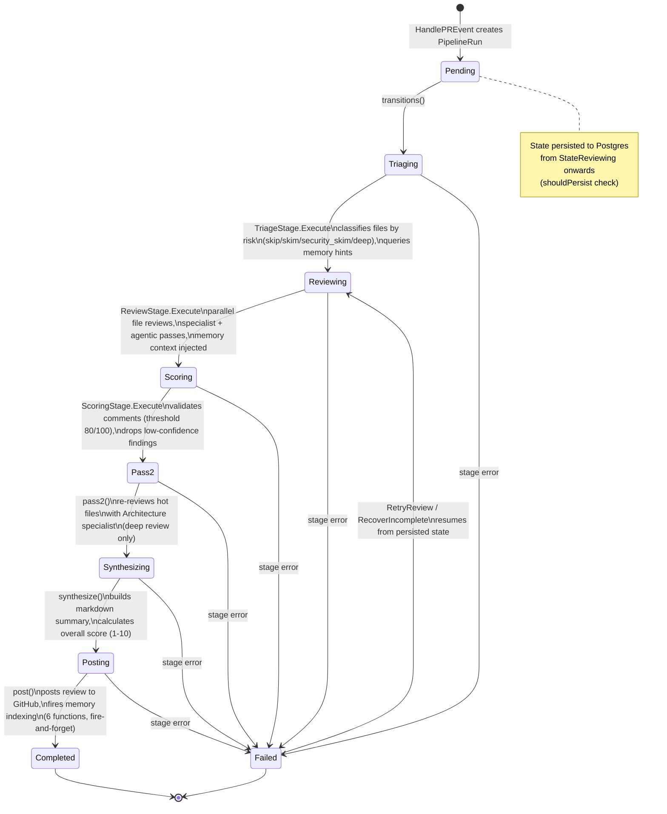
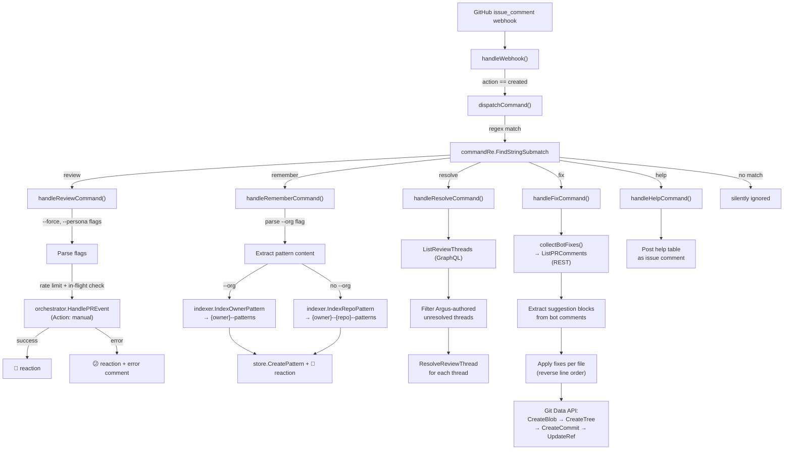
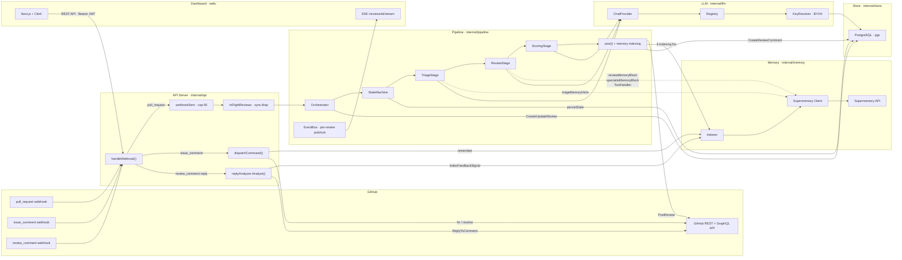

# Argus Architecture

## System Overview

Argus is an AI-powered code review bot that installs as a GitHub App. When a pull request is opened or updated, Argus fetches the diff, triages files by risk, reviews each file with an LLM, scores and filters comments, synthesizes a summary, posts the review to GitHub, and indexes everything it learned into a semantic memory store (Supermemory) for future reviews.

```
┌─────────────┐     webhook      ┌──────────────┐     orchestrate    ┌──────────────────┐
│   GitHub     │ ───────────────► │  API Server   │ ────────────────► │   Pipeline        │
│   (webhooks) │                  │  internal/api │                   │   Orchestrator    │
└─────────────┘                  └──────────────┘                   │   internal/       │
       ▲                               │                            │   pipeline        │
       │ post review                   │ auth (Clerk JWT)           └────────┬─────────┘
       │ reply to comment              ▼                                     │
       │                         ┌──────────────┐                           │
       │                         │  Web Dashboard│                    ┌─────┴──────┐
       │                         │  web/ (Next.js)│                   │             │
       │                         └──────────────┘              ┌─────▼───┐   ┌────▼─────┐
       │                                                       │  LLM    │   │ Memory   │
       └───────────────────────────────────────────────────────│ Registry│   │ (Super-  │
                                                               │ internal│   │  memory) │
                                                               │ /llm    │   │ internal │
                                                               └─────────┘   │ /memory  │
                                                                             └──────────┘
```

### Component Summary

| Component | Path | Purpose |
|-----------|------|---------|
| **API Server** | `internal/api/` | HTTP server (Chi router). Handles GitHub webhooks, REST API for dashboard, Clerk JWT auth, rate limiting, semaphore-based concurrency control |
| **GitHub App** | `internal/github/` | GitHub App authentication (JWT + installation tokens), PR diff fetching, review posting, GraphQL thread resolution, Git data API for `@argus-eye fix` |
| **Pipeline** | `internal/pipeline/` | State machine orchestrator with 6 stages: Triage → Review → Scoring → Pass2 → Synthesis → Post (memory indexing is part of Post) |
| **LLM Registry** | `internal/llm/` | Multi-provider LLM abstraction (OpenRouter, OpenAI, Anthropic, Groq, etc.). BYOK key resolution, per-repo model configs, tool-use support |
| **Memory** | `internal/memory/` | Supermemory REST client for semantic storage/retrieval. Indexer with deduplication (content-hashed `customId`). Container tag hierarchy for scoping |
| **Store** | `internal/store/` | PostgreSQL via pgx. Models: Installation, Repo, Review, ReviewComment, Rule, ProviderKey, ModelConfig, Pattern |
| **Crypto** | `internal/crypto/` | AES-256-GCM encryption for BYOK API keys at rest |
| **Config** | `internal/config/` | Environment variable loader for all service configuration |
| **Web Dashboard** | `web/` | Next.js 14 app with Clerk auth. Pages: Dashboard, Reviews, Repos, Patterns, Settings, Rules |
| **Diff Parser** | `pkg/diff/` | Unified diff parser producing `FileDiff` structs with line-level change tracking. `ValidCommentLines()` returns valid RIGHT-side line numbers for GitHub review comment validation |

---

## Pipeline State Machine

The pipeline is a linear state machine defined in `internal/pipeline/states.go` and executed by `StateMachine.Run()` in `internal/pipeline/statemachine.go`. Each state maps to a registered `StageFunc`. On failure, the machine transitions to `StateFailed`. On server restart, `RecoverIncomplete()` resumes all non-terminal runs.



### Stage Details

| State | Handler | Key Operations |
|-------|---------|----------------|
| `Triaging` | `TriageStage.Execute` | Classifies files into `skip`/`skim`/`security_skim`/`deep`. Queries `triageMemoryHints()` for file history + org patterns + rules |
| `Reviewing` | `ReviewStage.Execute` | Assigns specialists (BugHunter, Security, Architecture, Regression) based on triage action + `DeepReview` flag. Fan-out: N worker goroutines review files in parallel. Three review modes: (1) base prompt + `reviewMemoryBlock`, (2) specialist prompt + `specialistMemoryBlock`, (3) agentic tool-use loop with `search_memory`/`list_repos` tools. `security_skim` files get a single Security specialist pass. Publishes `EventComment` per file |
| `Scoring` | `ScoringStage.Execute` | Validates each comment with a separate scoring model. Drops comments below threshold (80/100). Fetches repo memory for calibration. No-op if scoring model not configured or `!DeepReview`. Sets `ScoringSkipped` flag when skipped, affecting downstream indexing thresholds |
| `Pass2` | `Orchestrator.pass2` | Deep review only. Identifies "hot" files (3+ comments scored 70+). Re-reviews with Architecture specialist. Merges pass2 comments into existing reviews |
| `Synthesizing` | `Orchestrator.synthesize` | Builds markdown summary from all file reviews. Calculates overall score (1-10). Publishes `EventSynthesis`. Incremental reviews use "Re-reviewed" header |
| `Posting` | `Orchestrator.post` | Validates comment line numbers against diff via `ValidCommentLines()` — drops comments targeting lines outside diff hunks. Posts review to GitHub via `ghClient.PostReview()`. Minimizes "review started" comment. Updates review record in DB. Fires 6 memory indexing functions (fire-and-forget) |

### "Review Started" Comment

Before the pipeline runs, `postStartedComment()` posts a rich markdown issue comment containing the model name, persona, review mode (deep/incremental), and a live-watch link to the dashboard (`https://argusai.vercel.app/reviews/{id}`). The comment's GraphQL node ID is captured into `run.StartedCommentNodeID`. After the full review is posted, `post()` calls `MinimizeComment()` with classifier `"RESOLVED"` to collapse the started comment.

### Incremental Re-Review

On `synchronize` events (new commits pushed to PR), `HandlePREvent()` fetches the last completed review's `HeadSHA` and calls `GetCompareCommitsDiff()` for the inter-commit diff. The `PipelineRun` gains `IsIncremental` and `PreviousReviewID` fields. `synthesize()` uses "Argus Review (Incremental)" header and "Re-reviewed" verb.

### Recovery

- **`StateMachine.Resume(runID)`**: Loads persisted `PipelineRun` from Postgres, continues from last saved state
- **`RecoverIncomplete()`**: Called on server startup. Queries all runs not in `completed`/`failed` state, resumes each in order of `updated_at`
- **`RetryReview(reviewID)`**: Triggered by dashboard "Retry" button. Finds pipeline run by review ID, resumes via `sm.Resume()`

---

## Memory Pipeline State Machine

This diagram shows how patterns flow through the memory system — from extraction after reviews, through Supermemory storage, to retrieval during future reviews, and the feedback loop that reinforces or suppresses patterns.

```mermaid
stateDiagram-v2
    direction LR

    state "Pattern Extraction\n(post-review)" as Extract {
        [*] --> indexComments: persist review\ncomments to DB +\nSupermemory
        [*] --> indexConfirmedPatterns: high-score comments\n(≥90 DeepReview, ≥95 non-deep)\nstored as repo patterns
        [*] --> autoLearnPatterns: LLM extracts 0-3\nreusable patterns\nfrom review comments
        [*] --> extractConventions: LLM identifies\ncode style conventions\nfrom diff additions
        [*] --> synthesizeFileMemories: LLM condenses\nper-file comments\ninto memory docs
        [*] --> indexPRSummary: lightweight PR\nsummary (no LLM call)
    }

    state "Supermemory Storage" as Store {
        owner_patterns: {owner}--patterns\n(org-wide patterns)
        owner_rules: {owner}--rules\n(org-wide rules)
        repo_patterns: {owner}--{repo}--patterns\n(repo patterns, conventions,\nfeedback signals, synthesis)
        repo_rules: {owner}--{repo}--rules\n(repo-specific rules)
        repo_reviews: {owner}--{repo}--reviews\n(individual review comments)
    }

    state "Memory Retrieval\n(during review)" as Retrieve {
        triageHints: triageMemoryHints()\nsearches repo patterns +\nowner patterns + owner rules
        reviewBlock: reviewMemoryBlock()\n5 parallel searches:\nrepo patterns, reviews,\nowner patterns, rules,\nfile synthesis
        specialistBlock: specialistMemoryBlock()\nfile synthesis +\nrepo patterns +\norg patterns
        agenticTools: ToolHandler.searchMemory()\non-demand RAG via\nsearch_memory tool
    }

    state "Feedback Loop" as Feedback {
        reply: ReplyAnalyzer.Analyze()\nprocesses developer replies
        confirmed: IndexFeedbackSignal\n(action=confirmed)\nreinforces pattern
        dismissed: IndexFeedbackSignal\n(action=dismissed)\nsuppresses pattern
    }

    Extract --> Store: AddMemory\n(/v3/documents)\nwith customId\ndeduplication
    Store --> Retrieve: Search\n(/v4/search)\nhybrid mode
    Retrieve --> LLMPrompt: injected into\nsystem prompt
    Feedback --> Store: upsert feedback\nsignal as pattern

    reply --> confirmed: resolve (no learning)\nor stand_firm
    reply --> dismissed: resolve + learning\n(Argus was wrong)
```



### Extraction Functions (called from `Orchestrator.post()`)

| Function | Trigger | What It Indexes | Container | Deduplication |
|----------|---------|-----------------|-----------|---------------|
| `indexComments` | All reviews | Each review comment with file path, severity, category | `{owner}--{repo}--reviews` | `FindingFingerprint` (file + category + body hash) |
| `indexConfirmedPatterns` | Score ≥ 90 (DeepReview) or ≥ 95 (non-DeepReview). Falls back to critical severity when scoring skipped | High-confidence comments as standalone patterns | `{owner}--{repo}--patterns` | `PatternCustomID` (source + content hash) |
| `autoLearnPatterns` | 2+ qualifying comments (DeepReview) or 1+ (non-DeepReview) | LLM-extracted reusable patterns from review comments | `{owner}--{repo}--patterns` | `PatternCustomID` (source + content hash) |
| `extractConventions` | PRs with 3+ files or 100+ changed lines | Code style conventions from diff additions (error handling, logging, naming, architecture) | `{owner}--{repo}--patterns` | `PatternCustomID` ("convention" + content hash) |
| `synthesizeFileMemories` | Files with 2+ comments at 70+ score or any 90+ comment | Per-file condensed memory doc | `{owner}--{repo}--patterns` | `SynthesisCustomID` (file path) |
| `indexPRSummary` | All reviews with synthesis | Lightweight PR summary (title, score, file count) | `{owner}--{repo}--patterns` | `PRSummaryCustomID` (PR number) |

### Retrieval Functions (called during review pipeline)

| Function | Called During | Containers Searched | Results Used For |
|----------|-------------|---------------------|------------------|
| `triageMemoryHints()` | `TriageStage` | `{owner}--{repo}--patterns`, `{owner}--patterns`, `{owner}--rules` | File risk classification, specialist assignment |
| `reviewMemoryBlock()` | `ReviewStage` (non-specialist) | `{owner}--{repo}--patterns`, `{owner}--{repo}--reviews`, `{owner}--patterns`, `{owner}--rules` + file synthesis | System prompt context for base reviews |
| `specialistMemoryBlock()` | `ReviewStage` (specialist) | `{owner}--{repo}--patterns`, `{owner}--patterns` + file synthesis | System prompt context for specialist reviews |
| `ToolHandler.searchMemory()` | `ReviewStage` (agentic) | Any `{owner}--*` scoped tag | On-demand RAG during agentic tool-use loop |

### Feedback Loop (via `ReplyAnalyzer`)

| Developer Action | Argus Response | Signal Stored | Effect on Future Reviews |
|-----------------|----------------|---------------|--------------------------|
| Fixes the issue | `resolve` (no learning) | `CONFIRMED pattern [category] in file: body` | Pattern reinforced — higher priority in future. GitHub thread resolved via `FindThreadForComment()` + `ResolveReviewThread()` |
| Explains Argus was wrong | `resolve` + learning extracted | `DISMISSED finding [category] in file: body. Future reviews should NOT flag similar patterns` | Pattern suppressed — avoided in future. GitHub thread resolved |
| Disagrees but Argus is right | `stand_firm` | `CONFIRMED pattern [category] in file: body` | Pattern reinforced |
| Asks for clarification | `clarify` | No signal | No memory effect |

---

## Command Dispatch Flow

Commands are triggered by `@argus-eye <command>` in PR issue comments. The webhook handler dispatches to `dispatchCommand()` which parses the command with regex `(?i)@argus-eye\s+(review|remember|resolve|fix|help)(.*)` and routes to the appropriate handler.



### Command Summary

| Command | Syntax | Effect |
|---------|--------|--------|
| `review` | `@argus-eye review [--force] [--persona <name>]` | Triggers manual review. `--force` bypasses duplicate SHA check. `--persona` overrides review personality |
| `remember` | `@argus-eye remember [--org] <pattern>` | Stores a pattern in Supermemory. `--org` scopes to owner level, otherwise repo level. Also persists to Postgres |
| `resolve` | `@argus-eye resolve` | Resolves all unresolved Argus review threads on the PR via GraphQL |
| `fix` | `@argus-eye fix` | Auto-applies suggested fixes from unresolved Argus comments. Creates a commit on the PR branch via Git Data API |
| `help` | `@argus-eye help` | Posts a help table listing all available commands |

---

## Data Flow Diagram



### Key Data Flow Paths

| Path | Flow |
|------|------|
| **PR Review** | GitHub webhook → `handleWebhook` → semaphore → `Orchestrator.HandlePREvent` → `StateMachine.Run` → Triage → Review → Scoring → Pass2 → Synthesis → Post → GitHub `PostReview` + memory indexing |
| **Memory Write** | `post()` → `indexComments` / `indexConfirmedPatterns` / `autoLearnPatterns` / `extractConventions` / `synthesizeFileMemories` / `indexPRSummary` → `Indexer` → Supermemory `/v3/documents` |
| **Memory Read** | `TriageStage` / `ReviewStage` → `triageMemoryHints` / `reviewMemoryBlock` / `specialistMemoryBlock` / `ToolHandler` → Supermemory `/v4/search` → injected into LLM system prompt |
| **Feedback Loop** | Developer reply → `review_comment` webhook (includes `NodeID` for thread lookup) → `ReplyAnalyzer.Analyze` → LLM decides action → `IndexFeedbackSignal` → Supermemory (confirmed/dismissed) + `ReplyToComment` on GitHub. On `resolve`: also calls `FindThreadForComment()` + `ResolveReviewThread()` |
| **Dashboard SSE** | `StateMachine` publishes events → `EventBus` → SSE endpoint `/reviews/{id}/stream` → Next.js dashboard real-time updates |

---

## Container Tag Hierarchy

Supermemory organizes memories using container tags that follow a hierarchical scoping model. Components within a tag are joined with `--` (double-dash) as separator. The `tagSanitizer` in `internal/memory/supermemory.go` replaces `/`, `:`, `~` with `-` (single-dash) within individual components to keep tags clean.

```
{owner}--patterns          ← org-wide learned patterns
{owner}--rules             ← org-wide review rules (from @argus-eye remember --org)
{owner}--{repo}--patterns  ← repo patterns, conventions, synthesis docs, feedback signals
{owner}--{repo}--rules     ← repo-specific rules (from @argus-eye remember)
{owner}--{repo}--reviews   ← individual review comments from past reviews
```

### Tag Construction Functions (`internal/memory/supermemory.go`)

- **`OwnerTag(owner, kind)`** → `{sanitized_owner}--{kind}` (e.g., `acme--patterns`)
- **`RepoTag(owner, repo, kind)`** → `{sanitized_owner}--{sanitized_repo}--{kind}` (e.g., `acme--api-server--reviews`)
- **`ValidateTagScope(tag, owner)`** → ensures tag starts with `{owner}--` (prevents cross-tenant access in agentic tool-use)

### Read/Write Matrix

| Container | Written By | Read By |
|-----------|-----------|---------|
| `{owner}--patterns` | `handleRememberCommand (--org)`, `ReplyAnalyzer (learning)` | `triageMemoryHints`, `reviewMemoryBlock`, `specialistMemoryBlock`, `ToolHandler` |
| `{owner}--rules` | `handleRememberCommand (--org)` | `triageMemoryHints`, `reviewMemoryBlock` |
| `{owner}--{repo}--patterns` | `indexConfirmedPatterns`, `autoLearnPatterns`, `extractConventions`, `synthesizeFileMemories`, `indexPRSummary`, `handleRememberCommand`, `IndexFeedbackSignal` | `triageMemoryHints`, `reviewMemoryBlock`, `specialistMemoryBlock`, `ScoringStage`, `ToolHandler` |
| `{owner}--{repo}--rules` | `handleRememberCommand` | `reviewMemoryBlock` |
| `{owner}--{repo}--reviews` | `indexComments` | `reviewMemoryBlock`, `ToolHandler` |

### Deduplication Strategy

All memory writes use content-hashed `customId` fields to enable upsert semantics (Supermemory deduplicates on `customId`, max 100 chars per Supermemory API):

| CustomID Function | Format | Used By |
|-------------------|--------|---------|
| `FindingFingerprint` | `{owner}--{repo}--{sanitized_file}--{hash12}` | `indexComments` |
| `PatternCustomID` | `{owner}--{repo}--{source}--{hash12}` | `indexConfirmedPatterns`, `autoLearnPatterns`, `extractConventions` |
| `SynthesisCustomID` | `{owner}--{repo}--{sanitized_file}--synthesis` (hash fallback if >100 chars) | `synthesizeFileMemories` |
| `PRSummaryCustomID` | `{owner}--{repo}--pr-{N}-summary` (no hash) | `indexPRSummary` |
| `FeedbackCustomID` | `{owner}--{repo}--feedback--{hash12}` | `IndexFeedbackSignal` |

All IDs are truncated to 100 characters max via `truncateIDWithSuffix()` to respect Supermemory's `customId` limit. Hashes are 12 hex chars (6 bytes of SHA-256). `normalizeBody()` strips line numbers and collapses whitespace before hashing for stable fingerprints.

---

## Additional API Endpoints

| Endpoint | Method | Purpose |
|----------|--------|---------|
| `/api/v1/installations/{id}/test-config` | POST | Sends a ping/ok round-trip to verify API key + model work. Returns `{success, response, latency_ms, tokens}` |
| `/api/v1/activity` | GET | Returns logged activity events (`manual_review_triggered`, `rule_created`, `rule_deleted`) via `store.LogActivity()` |

### Unwired Functions

- **`IndexRepoTopology`** (`internal/memory/indexer.go`): Stores inferred repo role/dependencies at owner scope with `{"type": "topology"}` metadata in `{owner}--patterns` container. Currently exists but is not called from any pipeline stage.