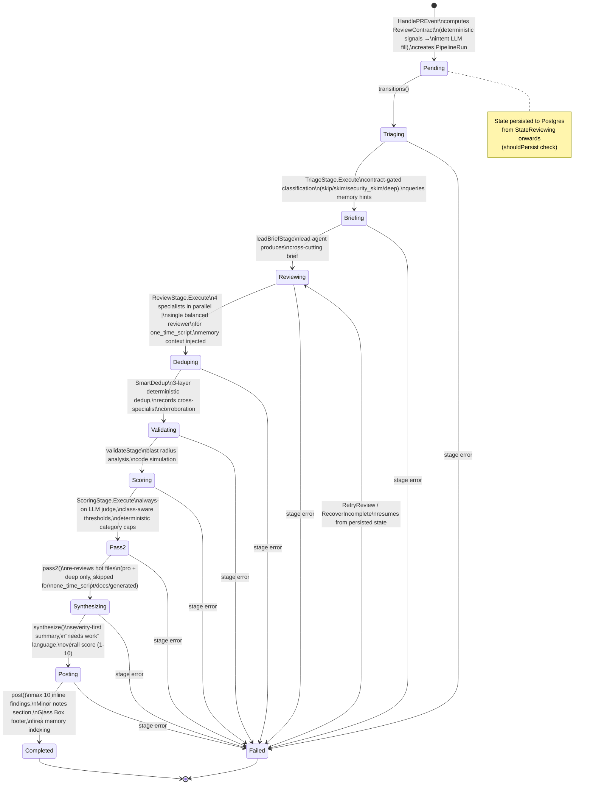
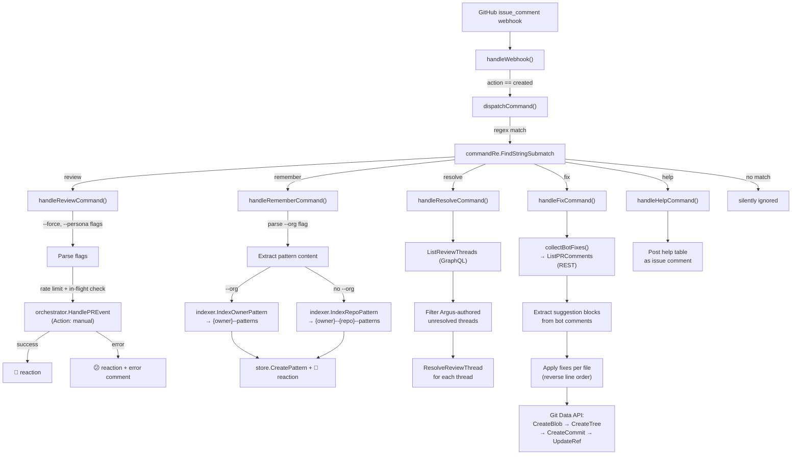
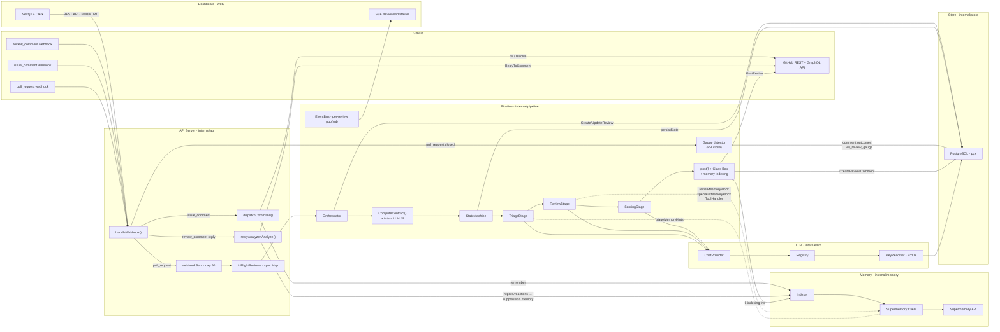

# Argus Architecture

## System Overview

Argus is an AI-powered code review bot that installs as a GitHub App. When a pull request is opened or updated, Argus computes a per-PR **ReviewContract** (change class, evidence bar, depth), fetches the diff, triages files by risk under that contract, reviews each file with an LLM, scores and filters comments, synthesizes a summary, posts the review to GitHub with a Glass Box footer, and indexes everything it learned into a semantic memory store (Supermemory) for future reviews. When the PR closes, a gauge detector measures which comments were actually addressed.

```
┌─────────────┐     webhook      ┌──────────────┐     orchestrate    ┌──────────────────┐
│   GitHub     │ ───────────────► │  API Server   │ ────────────────► │   Pipeline        │
│   (webhooks) │                  │  internal/api │                   │   Orchestrator    │
└─────────────┘                  └──────────────┘                   │   internal/       │
       ▲                               │                            │   pipeline        │
       │ post review                   │ auth (Clerk JWT)           └────────┬─────────┘
       │ reply to comment              ▼                                     │
       │                         ┌──────────────┐                           │
       │                         │  Web Dashboard│                    ┌─────┴──────┐
       │                         │  web/ (Next.js)│                   │             │
       │                         └──────────────┘              ┌─────▼───┐   ┌────▼─────┐
       │                                                       │  LLM    │   │ Memory   │
       └───────────────────────────────────────────────────────│ Registry│   │ (Super-  │
                                                               │ internal│   │  memory) │
                                                               │ /llm    │   │ internal │
                                                               └─────────┘   │ /memory  │
                                                                             └──────────┘
```

### Component Summary

| Component | Path | Purpose |
|-----------|------|---------|
| **API Server** | `internal/api/` | HTTP server (Chi router). Handles GitHub webhooks, REST API for dashboard, Clerk JWT auth, rate limiting, semaphore-based concurrency control |
| **GitHub App** | `internal/github/` | GitHub App authentication (JWT + installation tokens), PR diff fetching, review posting, GraphQL thread resolution, Git data API for `@argus-eye fix` |
| **Pipeline** | `internal/pipeline/` | State machine orchestrator with 9 stages: Triage → Briefing → Review → Dedup → Validate → Scoring → Pass2 → Synthesis → Post (memory indexing is part of Post). ReviewContract computation and intent extraction run pre-pipeline in `HandlePREvent`. Gauge detector runs on PR close |
| **LLM Registry** | `internal/llm/` | Multi-provider LLM abstraction (OpenRouter, OpenAI, Anthropic, Groq, etc.). BYOK key resolution, per-repo model configs, tool-use support |
| **Memory** | `internal/memory/` | Supermemory REST client for semantic storage/retrieval. Indexer with deduplication (content-hashed `customId`). Container tag hierarchy for scoping |
| **Store** | `internal/store/` | PostgreSQL via pgx. Models: Installation, Repo, Review (incl. `review_contract` jsonb), ReviewComment (incl. `state` ledger), Rule, ProviderKey, ModelConfig, Pattern. Views: `vw_review_gauge` |
| **Crypto** | `internal/crypto/` | AES-256-GCM encryption for BYOK API keys at rest |
| **Config** | `internal/config/` | Environment variable loader for all service configuration |
| **Web Dashboard** | `web/` | Next.js 14 app with Clerk auth. Pages: Dashboard, Reviews, Repos, Patterns, Settings, Rules |
| **Diff Parser** | `pkg/diff/` | Unified diff parser producing `FileDiff` structs with line-level change tracking. `ValidCommentLines()` returns valid RIGHT-side line numbers for GitHub review comment validation |

---

## Review Contract

Every PR gets a computed `ReviewContract{change_class, evidence_bar, depth, signals}` (`internal/pipeline/contract.go`) before the pipeline starts. `ComputeContract()` runs in `HandlePREvent` on the webhook event + parsed diff, and the contract is persisted to `reviews.review_contract` (migration 048). Downstream stages consume it to decide reviewer routing, Pass 2 eligibility, judge thresholds, and the Glass Box footer.

### Resolution Order: Deterministic Signals First

The contract is derived from cheap, deterministic PR metadata before any LLM sees the PR:

| Signal | Effect |
|--------|--------|
| Draft PR | `depth: skim` + evidence bar raised |
| `wip` / `hotfix` labels | `wip` → depth skim; `hotfix` → production class + raised evidence bar |
| Branch prefix `cutover\|migrate\|migration` | `change_class: migration` |
| Branch prefix `spike\|prototype\|poc` | `change_class: one_time_script` |
| Branch prefix `revert` | `change_class: revert` |
| Path-glob majority: `migrations/**` + `*.sql` | `change_class: migration` |
| Path-glob majority: `scripts/` `tools/` `bin/` | `change_class: one_time_script` |
| Path-glob majority: tests / docs / generated+lockfiles | `change_class: test` / `docs` / `generated` |
| Title contains `refactor\|rename\|cleanup` | Scrutiny bump (never lowers depth) |
| >1500 changed LOC or >60 files | `unreviewable: true` — still reviewed, posts a reduced-confidence note + split recommendation |

Only when metadata is silent does the LLM fill `change_class`: the pre-review intent stage (`IntentExtractionStage`) calls `ResolveFromLLM()`, accepted at confidence ≥ 0.6, otherwise the class defaults to `production`. Every contributing signal is recorded in `signals` — persisted on `reviews.review_contract` and rendered into the scoring prompt (the posted footer shows class/depth, not the signal list).

### The Floor Never Relaxes

Security-relevant files and `change_class: migration` max the evidence bar and pin depth at `single` or above. No label, branch name, or LLM classification can lower this floor.

### Contract Consumers

| Consumer | Behavior |
|----------|----------|
| `ReviewStage` | `one_time_script` gets a single balanced reviewer (correctness + data safety) instead of the 4-specialist squad |
| `TriageStage` | Depth-gates file triage: non-security files of throwaway/docs/generated/test classes downgrade to skim; migration forces deep on SQL |
| `Pass2` | `one_time_script` / `docs` / `generated` skip Pass 2 (`SkipsPass2()`) |
| `ScoringStage` | Class-aware judge thresholds: throwaway/docs/generated need near-certain findings (suggestion +15, warning +10); migration/security judged more sensitively on critical (−5) |
| `post()` | Glass Box footer renders contract class/depth, checked reviewers, suppressed count, duration (`BuildGlassBoxLine()`); unreviewable note when flagged |

---

## Review Laws

A single severity rubric is injected once into every prompt — specialists and personas are focus lenses on top of it, not competing rubrics:

- **Approve-with-findings is the default.** Silence is a valid review; there is no minimum comment count.
- **No praise comments.** Style/formatting is never flagged — that is the linter's job.
- **Evidence law:** every finding needs a concrete failure scenario and a `file:line` reference.
- **Fix law:** every finding supplies the fix.
- **Scope laws:** stay on the diff, on established repo patterns, and YAGNI — no speculative architecture asks.
- **Permanent checks:** destructive SQL missing `WHERE`/rollback, secrets/PII in log diffs, unit-ambiguous constants, refactor behavior-equivalence, unchecked errors. Memory suppression exempts the `security` category and findings matching the data-safety/secrets/error marker scan (`suppression.go` `permanentCheckMarkers`) — marker coverage for unit-ambiguity and behavior-equivalence is a known gap tracked as a follow-up.

---

## Pipeline State Machine

The pipeline is a linear state machine defined in `internal/pipeline/states.go` and executed by `StateMachine.Run()` in `internal/pipeline/statemachine.go`. Each state maps to a registered `StageFunc`. On failure, the machine transitions to `StateFailed`. On server restart, `RecoverIncomplete()` resumes all non-terminal runs.



### Stage Details

| State | Handler | Key Operations |
|-------|---------|----------------|
| `Triaging` | `TriageStage.Execute` | Classifies files into `skip`/`skim`/`security_skim`/`deep`, gated by the ReviewContract's depth. Queries `triageMemoryHints()` for file history + org patterns + rules |
| `Briefing` | `Orchestrator.leadBriefStage` | Lead agent produces a cross-cutting brief consumed by specialist prompts |
| `Reviewing` | `ReviewStage.Execute` | Assigns specialists (BugHunter, Security, Architecture, Regression) based on triage action + `DeepReview` flag. `one_time_script` PRs get a single balanced reviewer (correctness + data safety) instead of the 4-specialist squad. Fan-out: N worker goroutines review files in parallel. Three review modes: (1) base prompt + `reviewMemoryBlock`, (2) specialist prompt + `specialistMemoryBlock`, (3) agentic tool-use loop with `search_memory`/`list_repos` tools. `security_skim` files get a single Security specialist pass. Every prompt carries the Review Laws rubric. Publishes `EventComment` per file |
| `Deduping` | `Orchestrator.dedupStage` | 3-layer deterministic dedup via `SmartDedup()`: **Layer 1** canonical vuln type fingerprint (15 types — sql_injection, xss, path_traversal, etc.) groups findings by (file, vuln_type). **Layer 2** TF-IDF cosine similarity clusters ungrouped findings (>0.7 threshold). **Layer 3** line proximity merges same-file/same-category within 5 lines. Records cross-specialist corroboration (same finding from independent specialists) for scoring. Saves pre-dedup snapshot to `AllFileReviews` for pattern learning |
| `Validating` | `Orchestrator.validateStage` | Blast radius analysis (dependency graph impact) and code simulation on deduplicated findings |
| `Scoring` | `ScoringStage.Execute` | LLM judge runs for **every** review (deep enrichments stay pro+deep) and sees the PR body + ReviewContract. Scores findings 0-100 AND groups remaining duplicates (Layer 4 sweeper). Per-severity thresholds (critical 35 / warning 45 / suggestion 55) adjusted by contract class: throwaway/docs/generated raise the bar (suggestion +15, warning +10); migration/security lower it on critical (−5). No minimum-survivor floor — silence is a valid review. Deterministic category caps bind over the judge: style capped at 30, error_handling at 45 unless the file is security-relevant. Judge-omitted findings default to the threshold, not auto-pass. Cross-specialist corroboration adds a bounded +10 boost. Fallback: if LLM fails, deterministic dedup stands (`ScoringSkipped=true`). Score clamped to [0,100]. Fetches repo memory for calibration |
| `Pass2` | `Orchestrator.pass2` | Pro + deep review only; skipped entirely for `one_time_script`/`docs`/`generated` contracts. Identifies "hot" files (3+ comments scored 70+). Re-reviews with Architecture specialist. Merges pass2 comments, re-runs `SmartDedup` |
| `Synthesizing` | `Orchestrator.synthesize` | Builds markdown summary from all file reviews, severity-first, using "needs work" language (never "blocked"/"rejected"). Calculates overall score (1-10). Publishes `EventSynthesis`. Incremental reviews use "Re-reviewed" header |
| `Posting` | `Orchestrator.post` | Runs `rebalanceSeverity()` (caps criticals at 50% of total). Validates comment line numbers against diff via `ValidCommentLines()` — drops comments targeting lines outside diff hunks. Posts at most 10 inline findings severity-first; overflow folded into "plus N similar"; near-threshold findings go to a collapsed "Minor notes" section; nits are demoted off files that carry a critical. Appends the Glass Box footer (contract class/depth, what was checked, findings suppressed by team feedback, review duration). Posts review to GitHub via `ghClient.PostReview()`. Minimizes "review started" comment. Updates review record in DB. Fires 6 memory indexing functions (fire-and-forget) |

### "Review Started" Comment

Before the pipeline runs, `postStartedComment()` posts a rich markdown issue comment containing the model name, persona, review mode (deep/incremental), and a live-watch link to the dashboard (`https://argus.reviews/reviews/{id}`). The comment's GraphQL node ID is captured into `run.StartedCommentNodeID`. After the full review is posted, `post()` calls `MinimizeComment()` with classifier `"RESOLVED"` to collapse the started comment.

### Auto-Run Gate

Before the pipeline runs, `decideAutoRun()` (`internal/pipeline/persona.go`) decides whether a webhook PR event reviews automatically:

- **Manual** triggers (`@argus-eye review`, the Trigger checkbox — `event.Action == "manual"`) always review — explicit user intent.
- **Self-hosted** deploys (`SELF_HOSTED=true`) always review, unconditionally — there is no billing to gate, so stored settings are ignored.
- Otherwise the stored `auto_run` flag decides, **default ON**: `IsAutoRunEnabled` resolves a repo-explicit value first, else the org default, else on (a nil flag at both levels → on). A repo or org that sets `auto_run: false` opts out. The gate **fails closed** — when `GetOrgDefaults` errors, a repo with no explicit flag does NOT apply the on-by-default (we cannot prove the org did not opt out), mirroring the auto-resolve gate.

When auto-run is off, an honored event (opened/synchronize/reopened) is not a silent no-op: `signalAutoRunDisabled()` posts the one-shot "Trigger Argus review" checkbox comment (token/cost preview from `BuildEstimate`) once per PR, deduped on an `auto_run_disabled` marker review row so later pushes don't re-post.

Auto-resolve is gated separately (`IsAutoResolveEnabled`, also default ON) and runs on **every** synchronize regardless of auto-run — it is pure-diff and costs no LLM review spend, so a manual-review repo still gets stale threads cleared when a push fixes them.

### Incremental Re-Review

On `synchronize` (new commits pushed to an open PR), `IncrementalResolver.Resolve()` (`internal/pipeline/incremental.go`) computes the re-review plan **once per push** as an `IncrementalPlan`, shared by the review path and the auto-resolve goroutine:

- **Inter-diff.** It fetches the diff between the last *completed* review's `HeadSHA` and the new head via `GetCompareCommitsDiff()` — only what changed since the last review, not the whole PR. Exactly one compare round-trip per push (previously the review and auto-resolve paths each fetched it). When usable, this inter-diff replaces the full diff so the review is scoped to the new commits.
- **Priors across all reviews.** `PriorComments` aggregates and dedupes unresolved findings across **every** completed review on the PR — not just the most recent — so incremental dedup sees every previously-flagged issue and can avoid re-posting or verify fixes.
- **Full-review fallback.** When a prior review exists but a usable inter-diff cannot be produced — fetch error, empty compare (force-push or base change rewrote history), or a diff parse failure — the plan sets `Fallback` and the pipeline reviews the full diff instead. The resolver surfaces this as an `incremental.fallback` observability event (parse failures at Error level, the rest at Warn), so a silent, costly full run leaves a trace. A first push with no prior completed review is the ordinary full-review case, not a fallback.

The `PipelineRun` carries `IsIncremental` and `PreviousReviewID`; `synthesize()` uses the "Argus Review (Incremental)" header and "Re-reviewed" verb.

### Recovery

- **`StateMachine.Resume(runID)`**: Loads persisted `PipelineRun` from Postgres, continues from last saved state
- **`RecoverIncomplete()`**: Called on server startup. Queries all runs not in `completed`/`failed` state, resumes each in order of `updated_at`
- **`RetryReview(reviewID)`**: Triggered by dashboard "Retry" button. Finds pipeline run by review ID, resumes via `sm.Resume()`

---

## Memory Pipeline State Machine

This diagram shows how patterns flow through the memory system — from extraction after reviews, through Supermemory storage, to retrieval during future reviews, and the feedback loop that reinforces or suppresses patterns.

```mermaid
stateDiagram-v2
    direction LR

    state "Pattern Extraction\n(post-review)" as Extract {
        [*] --> indexComments: persist review\ncomments to DB +\nSupermemory
        [*] --> indexConfirmedPatterns: high-score comments\n(≥90 DeepReview, ≥95 non-deep)\nstored as repo patterns
        [*] --> autoLearnPatterns: LLM extracts 0-3\nreusable patterns\nfrom review comments
        [*] --> extractConventions: LLM identifies\ncode style conventions\nfrom diff additions
        [*] --> synthesizeFileMemories: LLM condenses\nper-file comments\ninto memory docs
        [*] --> indexPRSummary: lightweight PR\nsummary (no LLM call)
    }

    state "Supermemory Storage" as Store {
        owner_patterns: {owner}--patterns\n(org-wide patterns)
        owner_rules: {owner}--rules\n(org-wide rules)
        repo_patterns: {owner}--{repo}--patterns\n(repo patterns, conventions,\nfeedback signals, synthesis)
        repo_rules: {owner}--{repo}--rules\n(repo-specific rules)
        repo_reviews: {owner}--{repo}--reviews\n(individual review comments)
    }

    state "Memory Retrieval\n(during review)" as Retrieve {
        triageHints: triageMemoryHints()\nsearches repo patterns +\nowner patterns + owner rules
        reviewBlock: reviewMemoryBlock()\n5 parallel searches:\nrepo patterns, reviews,\nowner patterns, rules,\nfile synthesis
        specialistBlock: specialistMemoryBlock()\nfile synthesis +\nrepo patterns +\norg patterns
        agenticTools: ToolHandler.searchMemory()\non-demand RAG via\nsearch_memory tool
    }

    state "Feedback Loop" as Feedback {
        reply: ReplyAnalyzer.Analyze()\nprocesses developer replies
        confirmed: IndexFeedbackSignal\n(action=confirmed)\nreinforces pattern
        dismissed: IndexFeedbackSignal\n(action=dismissed)\nstored by category+content\nwith change_kind + reason
    }

    Extract --> Store: AddMemory\n(/v3/documents)\nwith customId\ndeduplication
    Store --> Retrieve: Search\n(/v4/search)\nhybrid mode
    Retrieve --> LLMPrompt: injected into\nsystem prompt
    Feedback --> Store: upsert feedback\nsignal as pattern

    reply --> confirmed: resolve (no learning)\nor stand_firm
    reply --> dismissed: resolve + learning\n(Argus was wrong)
```



### Extraction Functions (called from `Orchestrator.post()`)

| Function | Trigger | What It Indexes | Container | Deduplication |
|----------|---------|-----------------|-----------|---------------|
| `indexComments` | All reviews | Each review comment with file path, severity, category | `{owner}--{repo}--reviews` | `FindingFingerprint` (file + category + body hash) |
| `indexConfirmedPatterns` | Score ≥ 90 (DeepReview) or ≥ 95 (non-DeepReview). Falls back to critical severity when scoring skipped | High-confidence comments as standalone patterns | `{owner}--{repo}--patterns` | `PatternCustomID` (source + content hash) |
| `autoLearnPatterns` | 2+ qualifying comments (DeepReview) or 1+ (non-DeepReview) | LLM-extracted reusable patterns from review comments | `{owner}--{repo}--patterns` | `PatternCustomID` (source + content hash) |
| `extractConventions` | PRs with 3+ files or 100+ changed lines | Code style conventions from diff additions (error handling, logging, naming, architecture) | `{owner}--{repo}--patterns` | `PatternCustomID` ("convention" + content hash) |
| `synthesizeFileMemories` | Files with 2+ comments at 70+ score or any 90+ comment | Per-file condensed memory doc | `{owner}--{repo}--patterns` | `SynthesisCustomID` (file path) |
| `indexPRSummary` | All reviews with synthesis | Lightweight PR summary (title, score, file count) | `{owner}--{repo}--patterns` | `PRSummaryCustomID` (PR number) |

### Retrieval Functions (called during review pipeline)

| Function | Called During | Containers Searched | Results Used For |
|----------|-------------|---------------------|------------------|
| `triageMemoryHints()` | `TriageStage` | `{owner}--{repo}--patterns`, `{owner}--patterns`, `{owner}--rules` | File risk classification, specialist assignment |
| `reviewMemoryBlock()` | `ReviewStage` (non-specialist) | `{owner}--{repo}--patterns`, `{owner}--{repo}--reviews`, `{owner}--patterns`, `{owner}--rules` + file synthesis | System prompt context for base reviews |
| `specialistMemoryBlock()` | `ReviewStage` (specialist) | `{owner}--{repo}--patterns`, `{owner}--patterns` + file synthesis | System prompt context for specialist reviews |
| `ToolHandler.searchMemory()` | `ReviewStage` (agentic) | Any `{owner}--*` scoped tag | On-demand RAG during agentic tool-use loop |

### Feedback Loop (via `ReplyAnalyzer`)

| Developer Action | Argus Response | Signal Stored | Effect on Future Reviews |
|-----------------|----------------|---------------|--------------------------|
| Fixes the issue | `resolve` (no learning) | `CONFIRMED pattern [category] in file: body` | Pattern reinforced — higher priority in future. GitHub thread resolved via `FindThreadForComment()` + `ResolveReviewThread()` |
| Explains Argus was wrong | `resolve` + learning extracted | Dismissal keyed by category+content (semantic, file-path-free) with `change_kind` + reason | Pattern suppressed per the rules below. GitHub thread resolved |
| Disagrees but Argus is right | `stand_firm` | `CONFIRMED pattern [category] in file: body` | Pattern reinforced |
| Asks for clarification | `clarify` | No signal | No memory effect |
| Finding doesn't apply to this kind of change | `not_applicable_change_kind` | Dismissal scoped to the change kind | Suppression does not cross change kinds |

### Suppression v2

Dismissals are stored by category+content — semantic and file-path-free — carrying the `change_kind` of the PR they came from and the developer's reason. A future finding is suppressed when any of:

- a single dismissal matches at ≥ 0.85 similarity, or
- ≥ 3 similar dismissals match at ≥ 0.60, or
- the category is auto-suppressed after 3 consecutive negative outcomes.

Exemptions and scoping:

- **Security findings and permanent checks are exempt** — feedback can downgrade them, never mute them.
- **Change-kind scoping:** dismissals from prototype/one-off-era PRs do not silence production or migration reviews.
- **Re-review resolution:** when a push modifies a previously flagged finding's lines, auto-resolve resolves the thread — but only after the addressed-judge confirms the change actually fixed it (see [Comment Lifecycle](#comment-lifecycle)).

---

## Comment Lifecycle

Every posted finding has exactly one terminal lifecycle state, reconciled across the GitHub review thread and the DB ledger by the **FindingLifecycle** module (`internal/pipeline/finding_lifecycle.go`). `Transition()` is the ONLY writer of `review_comments.state` and the ONLY caller of GitHub thread resolution for a finding's lifecycle — every writer (reply, reaction, auto-resolve, `@argus resolve`, the PR-closed gauge) routes through it, so the thread state and the ledger cannot drift.

### States (`review_comments.state`)

| State | Meaning | Set by |
|-------|---------|--------|
| `posted` | Shipped to the PR, no outcome yet (column default) | insert |
| `addressed` | The flagged problem was fixed — **judge-verified** (below) | auto-resolve on synchronize; a privileged reply confirming the fix; the gauge at merge |
| `dismissed` | The developer rejected the finding | a privileged reply, or a 👎-dominant reaction (ledger-only) |
| `deferred` | Acknowledged but not fixed — PR closed without merging | the gauge on an unmerged close |
| `resolved` | A maintainer explicitly closed the threads via `@argus resolve` | the resolve command (maintainer-only) |
| `suppressed` | Never posted — dropped by the suppression pass | insert only |

### Transitions & the authorization boundary

FindingLifecycle splits events into DECISIONS (record the ledger first, then best-effort resolve the thread) and ASSERTIONS (resolve the thread first, assert the closed state only on success), so neither over-claims when a GitHub call fails. A provenance rule keeps a *heuristic* `addressed` (auto-resolve / gauge proximity) from ever overwriting an explicit human `dismissed`; only a reply's human evidence can.

Resolving a thread clears the finding from GitHub's require-conversation-resolution merge gate, so it is privileged — the authorization boundary is enforced at each call site so **untrusted commenters cannot clear findings from the merge gate**:

- **Reactions are ledger-only.** A 👎 sets `state=dismissed` for suppression memory but NEVER resolves the thread — a reaction is an untrusted, low-effort signal swept from any user, including fork contributors with no write access.
- **Replies are gated on `author_association`.** Only an owner/member/collaborator reply resolves the thread and writes terminal state; a non-privileged reply keeps its learning signal (pattern/feedback) but does not clear the finding.
- **`@argus resolve` is maintainer-only.** A non-privileged commenter gets a "confused" reaction and a refusal message; only owner/member/collaborator pass `IsPrivilegedAssociation` (`internal/github/identity.go`).

Accepted, intentional corner: a 👎-dismissed finding's thread stays open (ledger-only), so a later push modifying its lines can resolve the *thread* while the provenance rule keeps the *ledger* at `dismissed`.

### Auto-resolve + the addressed-judge

On a synchronize push, `autoResolveOnSynchronize()` closes stale finding threads whose anchored lines the push touched — but proximity (`decideAutoResolveThread`) is only a cheap **prefilter**, never proof a finding was fixed. Each proximity candidate goes to the **AddressedJudge** (`addressed_judge.go`), an LLM-as-judge over the review-stage model that reads the finding and the file's inter-diff and decides whether the change *actually addresses* the finding versus merely moving or reformatting nearby lines. Only on a confirmed fix does FindingLifecycle fire `EventAddressed` (thread resolved + `state=addressed`) and stamp the resolving commit SHA (`resolved_sha`) as the resolved-by-commit breadcrumb.

The judge **degrades safe**: on any error, timeout, not-addressed verdict, or a missing judge, the thread stays OPEN — a judge failure never false-resolves. Cost is bounded to the proximity candidate set and capped per push (`maxJudgeCallsPerPush`).

### Review viewer

The dashboard review-detail page (`web/src/app/(dashboard)/reviews/[id]/page.tsx`) surfaces the lifecycle: each finding shows a state pill (`FindingStateBadge`), a resolved-by-commit breadcrumb (from `resolved_sha`), and an **Incremental history** timeline merging every per-SHA review pass (with `+N new` findings) and every auto-resolve push (`Auto-resolved N threads`).

---

## Review Gauge

The gauge (`internal/pipeline/gauge.go`) measures whether posted comments actually changed the code — the ground-truth signal behind suppression and calibration.

On PR close, a detector diffs the commits pushed after each posted comment, matching within ±3 lines of the comment's location, and records an outcome:

| Outcome | Meaning |
|---------|---------|
| `addressed_human` | A human commit changed the flagged lines |
| `addressed_agent` | A bot-pattern author changed the flagged lines (weighted 0.5) |
| `ignored` | PR merged with the flagged lines untouched |
| `deferred` | PR closed without merging (all findings on an unmerged close, regardless of line changes) |

Outcomes land in the comment outcome vocabulary (`comment_outcomes`, migration 049, with `addressed_at`). Each terminal outcome ALSO drives the matching `review_comments.state` through FindingLifecycle (see [Comment Lifecycle](#comment-lifecycle)) — the gauge writes `addressed_*` + `state=addressed` and `deferred` + `state=deferred` — so the finer multi-signal `comment_outcomes` ledger and the terminal state ledger cannot silently disagree. (`review_comments.state` spans `posted`/`addressed`/`dismissed`/`deferred`/`resolved`/`suppressed`; the gauge is one of its writers, alongside reply/reaction dismissals, auto-resolve, `@argus resolve`, and insert-time suppression.) The `vw_review_gauge` view (migration 050) aggregates address-rate per category per change_class, dismiss rate, and median time-to-merge. Exposed at the authenticated, installation-scoped `GET /api/v1/stats/gauge` (`internal/api/handlers_gauge.go`).

---

## Command Dispatch Flow

Commands are triggered by `@argus-eye <command>` in PR issue comments. The webhook handler dispatches to `dispatchCommand()` which parses the command with regex `(?i)@argus-eye\s+(review|remember|resolve|fix|help)(.*)` and routes to the appropriate handler.



### Command Summary

| Command | Syntax | Effect |
|---------|--------|--------|
| `review` | `@argus-eye review [--force] [--persona <name>]` | Triggers manual review. `--force` bypasses duplicate SHA check. `--persona` overrides review personality |
| `remember` | `@argus-eye remember [--org] <pattern>` | Stores a pattern in Supermemory. `--org` scopes to owner level, otherwise repo level. Also persists to Postgres |
| `resolve` | `@argus-eye resolve` | Resolves all unresolved Argus review threads on the PR via GraphQL and marks each finding `state=resolved`. Maintainer-only — a non-privileged commenter (not owner/member/collaborator) is refused |
| `fix` | `@argus-eye fix` | Auto-applies suggested fixes from unresolved Argus comments. Creates a commit on the PR branch via Git Data API |
| `help` | `@argus-eye help` | Posts a help table listing all available commands |

---

## Data Flow Diagram



### Key Data Flow Paths

| Path | Flow |
|------|------|
| **PR Review** | GitHub webhook → `handleWebhook` → semaphore → `Orchestrator.HandlePREvent` → `ComputeContract` + intent fill → `StateMachine.Run` → Triage → Briefing → Review → Dedup → Validate → Scoring → Pass2 → Synthesis → Post → GitHub `PostReview` (Glass Box footer) + memory indexing |
| **Memory Write** | `post()` → `indexComments` / `indexConfirmedPatterns` / `autoLearnPatterns` / `extractConventions` / `synthesizeFileMemories` / `indexPRSummary` → `Indexer` → Supermemory `/v3/documents` |
| **Memory Read** | `TriageStage` / `ReviewStage` → `triageMemoryHints` / `reviewMemoryBlock` / `specialistMemoryBlock` / `ToolHandler` → Supermemory `/v4/search` → injected into LLM system prompt |
| **Feedback Loop** | Developer reply → `review_comment` webhook (includes `NodeID` for thread lookup) → `ReplyAnalyzer.Analyze` → LLM decides action → `IndexFeedbackSignal` → Supermemory (confirmed / dismissal keyed by category+content with change_kind) + `ReplyToComment` on GitHub. On `resolve`: also calls `FindThreadForComment()` + `ResolveReviewThread()` |
| **Gauge** | PR close → detector diffs commits after each comment (±3-line proximity) → outcomes `addressed_human`/`addressed_agent`/`ignored` (merged, untouched)/`deferred` (closed unmerged) → `vw_review_gauge` → `GET /api/v1/stats/gauge` |
| **Dashboard SSE** | `StateMachine` publishes events → `EventBus` → SSE endpoint `/reviews/{id}/stream` → Next.js dashboard real-time updates |

---

## Container Tag Hierarchy

Supermemory organizes memories using container tags that follow a hierarchical scoping model. Components within a tag are joined with `--` (double-dash) as separator. The `tagSanitizer` in `internal/memory/supermemory.go` replaces `/`, `:`, `~` with `-` (single-dash) within individual components to keep tags clean.

```
{owner}--patterns          ← org-wide learned patterns
{owner}--rules             ← org-wide review rules (from @argus-eye remember --org)
{owner}--{repo}--patterns  ← repo patterns, conventions, synthesis docs, feedback signals
{owner}--{repo}--rules     ← repo-specific rules (from @argus-eye remember)
{owner}--{repo}--reviews   ← individual review comments from past reviews
```

### Tag Construction Functions (`internal/memory/supermemory.go`)

- **`OwnerTag(owner, kind)`** → `{sanitized_owner}--{kind}` (e.g., `acme--patterns`)
- **`RepoTag(owner, repo, kind)`** → `{sanitized_owner}--{sanitized_repo}--{kind}` (e.g., `acme--api-server--reviews`)
- **`ValidateTagScope(tag, owner)`** → ensures tag starts with `{owner}--` (prevents cross-tenant access in agentic tool-use)

### Read/Write Matrix

| Container | Written By | Read By |
|-----------|-----------|---------|
| `{owner}--patterns` | `handleRememberCommand (--org)`, `ReplyAnalyzer (learning)` | `triageMemoryHints`, `reviewMemoryBlock`, `specialistMemoryBlock`, `ToolHandler` |
| `{owner}--rules` | `handleRememberCommand (--org)` | `triageMemoryHints`, `reviewMemoryBlock` |
| `{owner}--{repo}--patterns` | `indexConfirmedPatterns`, `autoLearnPatterns`, `extractConventions`, `synthesizeFileMemories`, `indexPRSummary`, `handleRememberCommand`, `IndexFeedbackSignal` | `triageMemoryHints`, `reviewMemoryBlock`, `specialistMemoryBlock`, `ScoringStage`, `ToolHandler` |
| `{owner}--{repo}--rules` | `handleRememberCommand` | `reviewMemoryBlock` |
| `{owner}--{repo}--reviews` | `indexComments` | `reviewMemoryBlock`, `ToolHandler` |

### Deduplication Strategy

All memory writes use content-hashed `customId` fields to enable upsert semantics (Supermemory deduplicates on `customId`, max 100 chars per Supermemory API):

| CustomID Function | Format | Used By |
|-------------------|--------|---------|
| `FindingFingerprint` | `{owner}--{repo}--{sanitized_file}--{hash12}` | `indexComments` |
| `PatternCustomID` | `{owner}--{repo}--{source}--{hash12}` | `indexConfirmedPatterns`, `autoLearnPatterns`, `extractConventions` |
| `SynthesisCustomID` | `{owner}--{repo}--{sanitized_file}--synthesis` (hash fallback if >100 chars) | `synthesizeFileMemories` |
| `PRSummaryCustomID` | `{owner}--{repo}--pr-{N}-summary` (no hash) | `indexPRSummary` |
| `FeedbackCustomID` | `{owner}--{repo}--feedback--{hash12}` | `IndexFeedbackSignal` |

All IDs are truncated to 100 characters max via `truncateIDWithSuffix()` to respect Supermemory's `customId` limit. Hashes are 12 hex chars (6 bytes of SHA-256). `normalizeBody()` strips line numbers and collapses whitespace before hashing for stable fingerprints.

---

## Additional API Endpoints

| Endpoint | Method | Purpose |
|----------|--------|---------|
| `/api/v1/installations/{id}/test-config` | POST | Sends a ping/ok round-trip to verify API key + model work. Returns `{success, response, latency_ms, tokens}` |
| `/api/v1/activity` | GET | Returns logged activity events (`manual_review_triggered`, `rule_created`, `rule_deleted`) via `store.LogActivity()` |
| `/api/v1/stats/gauge` | GET | Internal gauge telemetry from `vw_review_gauge`: address-rate per category per change_class, dismiss rate, median time-to-merge |

### Unwired Functions

- **`IndexRepoTopology`** (`internal/memory/indexer.go`): Stores inferred repo role/dependencies at owner scope with `{"type": "topology"}` metadata in `{owner}--patterns` container. Currently exists but is not called from any pipeline stage.

---

## Licensing

Argus follows the **Sustainable Use License** model (similar to n8n):

- **Core**: Licensed under the [Sustainable Use License](../LICENSE). Free for internal business use and non-commercial/personal use. Self-hosting is allowed.
- **Enterprise**: Files containing `.ee.` in their filename or `.ee/` in their directory path require a commercial Argus Enterprise License.

**What the Sustainable Use License allows:**
- Self-host Argus for your internal code reviews
- Modify and customize for your own use
- Free for personal and non-commercial projects

**What it restricts:**
- Cannot offer Argus as a competing hosted/SaaS service
- Cannot remove licensing notices

The hosted service at [argus.reviews](https://argus.reviews) offers managed hosting with both core and enterprise features, which funds ongoing development.

Examples of this model: n8n, Cal.com